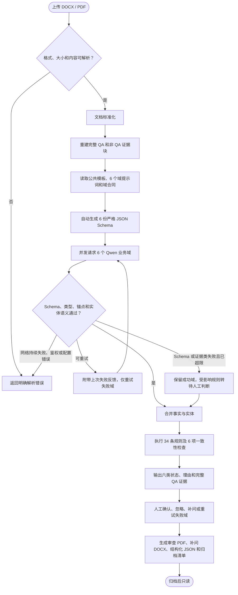
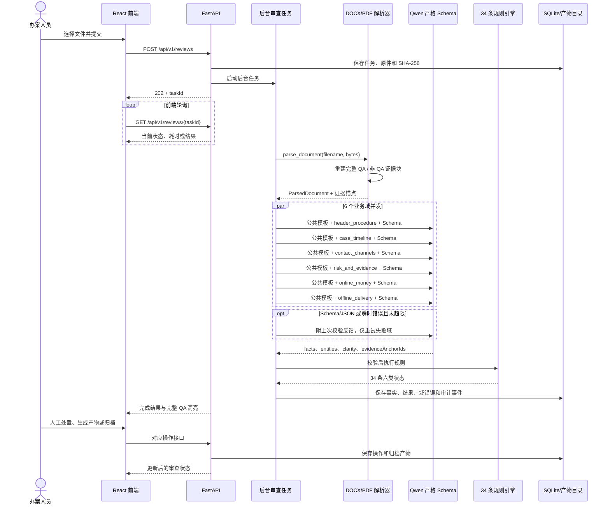

# 公安智能笔录审查助手

本项目用于辅助复核电信网络诈骗询问笔录。上传 DOCX 或 PDF 后，系统重建完整问答对，使用 Qwen 严格 JSON Schema 并发抽取 6 个业务域的事实，再由后端 34 条规则完成状态分流、原文定位、人工处置、补问清单和归档报告。

系统只提供审查线索，不作案件定性、法律结论或证据效力判断。所有模型结果和规则结果均需办案人员结合原文复核。

## 快速启动

### 环境要求

- Windows 10/11
- Python 3.11+
- Node.js 20+
- 可用的 OpenAI 兼容多模态模型接口

开发目录首次安装：

```powershell
python -m venv backend\.venv
backend\.venv\Scripts\python.exe -m pip install -r backend\requirements.txt
npm --prefix frontend install
```

将 `backend/.env.example` 复制为 `backend/.env.local`，填写模型连接信息：

```dotenv
QWEN_BASE_URL=https://example.com/compatible-mode/v1
QWEN_API_KEY=replace-with-your-api-key
QWEN_MODEL=qwen3.6-35b-a3b
QWEN_DOMAIN_CONCURRENCY=6
QWEN_TRANSIENT_RETRIES=1
QWEN_SCHEMA_RETRIES=1
PORT=8787
FRONTEND_ORIGIN=http://127.0.0.1:4173
```

启动后端：

```powershell
backend\.venv\Scripts\python.exe -m uvicorn app.main:app --app-dir backend --host 127.0.0.1 --port 8787
```

启动前端：

```powershell
npm --prefix frontend run dev -- --host 127.0.0.1 --port 4173 --strictPort
```

- 前端：<http://127.0.0.1:4173/>
- 后端健康检查：<http://127.0.0.1:8787/api/v1/health>
- Swagger：<http://127.0.0.1:8787/api/docs>

桌面交付版可先运行 `install-dependencies.bat`，再运行 `start.bat`。

## 审查流程图

可编辑源文件：[current-review-flow.drawio](docs/diagrams/current-review-flow.drawio)。



## 真实请求时序图

可编辑源文件：[current-review-sequence.drawio](docs/diagrams/current-review-sequence.drawio)，生成输入保存在 [current-review-sequence.json](docs/diagrams/current-review-sequence.json)。



## 文档解析

解析结果分为两类证据块：

- `qa`：从“问：/答：”标记开始重建，一个完整问题及其完整答案作为一个证据块。支持同段、跨段和跨页拼接，UI 高亮覆盖整组问答关联的原始段落。
- `text`：没有进入问答状态机的结构化文本按原文顺序保留，例如笔录头部、程序信息、页眉页脚和普通段落。

括号内模板说明会移入 `guidance`，避免被模型当成案件事实。解析器会先识别 DOCX 正文、表格、页眉页脚和嵌入媒体；PDF 保留原生文本坐标，并可将扫描页或图片作为视觉输入。图片中的 QA 能否完整识别仍取决于多模态模型，不应视为与原生文本相同的确定性能力。

支持 DOCX、PDF，单文件最大 20 MB；不支持旧版 `.doc`。文件为空、格式不支持、损坏或模型未配置等基础错误仍会使任务失败，因为系统没有可靠事实可供规则分流。

## 6 个事实域和提示词

提示词采用三层组合，运行时临时渲染，不保存包含原文的完整提示词：

1. `backend/prompt-templates/domain-extraction.txt`：公共约束，包括禁止推测、`clarity`、锚点白名单、重复实体和上次校验反馈。
2. `backend/prompt-templates/domains/*.txt`：6 个域各自的易错语义。
3. `backend/domain-contracts/*.json`：字段含义、类型、取值范围、实体结构；服务端据此自动生成提示词字段清单和 JSON Schema。

当前域提示词已经针对已发现的误判做过优化：

| 域 | 负责内容 | 已落实的针对性优化 |
|---|---|---|
| `header_procedure` | 笔录头部、权利告知和程序事项 | “无、否、没有其他要求、不适用”作为清晰回答；已阅读告知书不再判漏问；复用结构区姓名 |
| `case_timeline` | 报案原因、诈骗手法、经过、时间地点、隐私、付款和持续联系原因 | 排除联系渠道和逐笔资金的重复概括；“没有补充”与空答案严格区分 |
| `contact_channels` | 首次联系、聊天工具、账号和联系切换实体 | 电话/短信号码可作为首次联系标识；无法确认聊天工具时返回 `unknown`；联系人详情不重复生成 |
| `risk_and_evidence` | 预警劝阻、风险操作、录音和证据 | 明确否定返回清晰事实；录音空答不从通话事实推断；实名或聊天工具不确定时交人工判断 |
| `online_money` | 总损失、笔数、逐笔转账和返款总额 | 金额和笔数按原文抽取，即使相互矛盾也不擅自改值；不生成重复返款实体；流水号为辅助字段 |
| `offline_delivery` | 取现、网点、线下交付和邮寄物流 | 银行/网点/地点分开；完整地址为辅助字段；明确未使用某种交付方式视为清晰否定 |

这些属于针对已知问题的提示词修正，不等于已经证明所有格式、所有案情都达到固定准确率。通用性仍需用不同格式笔录做人工金标准对照。

## 严格 JSON Schema 与重试

模型请求始终使用：

- `response_format.type=json_schema`
- `strict=true`
- `enable_thinking=false`
- `temperature=0`
- 禁止 plain JSON 和 tool fallback

每个域独立请求、独立校验、独立重试。`QWEN_DOMAIN_CONCURRENCY=6` 表示正常审查同时发出 6 个域请求。

| 情况 | 处理 |
|---|---|
| JSON 无法解析、字段类型错误、额外字段、Schema 未真正执行 | 将错误字段和校验反馈附到下一次同域提示词，最多按 `QWEN_SCHEMA_RETRIES` 重试 |
| 连接失败、超时或 HTTP 5xx | 最多按 `QWEN_TRANSIENT_RETRIES` 重试同一域 |
| Schema、响应或证据类错误重试后仍失败 | 保留成功域；失败域影响的规则统一转 `needs_manual_review`，任务仍可进入结果页 |
| 持续网络故障、鉴权失败、模型未配置、严格 Schema 不受支持 | 任务失败并返回错误，不伪造审查结论 |

实体数量与事实笔数不一致不会中断域抽取，而由一致性规则显示为事实矛盾。

## clarity 与 34 条规则

模型只抽取事实，不直接输出“已通过/未询问”等规则状态。每个事实包含：

- `value`：受域合同约束的布尔、数字、字符串、数组或 `null`。
- `clarity`：`clear`、`unclear`、`unknown`、`missing`。
- `evidenceAnchorIds`：最多 5 个服务端白名单锚点。

规则引擎读取 `backend/template_rules.json`，结合事实、问题是否存在、适用条件、重复实体和 6 项金额/数量/时间一致性检查，固定返回 34 条结果：

| 前端状态 | API 值 | 主要含义 |
|---|---|---|
| 已通过 | `covered` | 适用事实清晰且满足规则；明确“无、否、不适用”也可能是有效通过 |
| 未询问 | `missing` | 未检索到相关问题且没有清晰事实 |
| 回答不清 | `incomplete` | 问题存在但空答、`unclear` 或关键明细不足 |
| 事实矛盾 | `inconsistent` | 明确金额、数量、时间或实体计数相互冲突 |
| 规则不适用 | `not_applicable` | 有清晰事实证明适用条件为否 |
| 待人工判断 | `needs_manual_review` | 适用性为 `unknown`，或相关事实域无法可靠完成 |

`advisoryFields` 缺失只形成非阻断提示。人工处置状态与自动规则状态并列保存，不会篡改原始模型事实或规则结果。

## 结果、补问和归档

审查结果页显示 34 条规则、六类汇总、被害人信息、完整 QA 证据和高亮位置。办案人员可确认、忽略、加入补问或重试失败域。

生成的归档产物包括：

- 审查报告 PDF，前部显示人工处理汇总。
- 补问工作清单 DOCX。
- 结构化审查 JSON。
- 含 SHA-256 的归档清单。

归档前会检查待处置项、未确认解析警告和产物完整性；归档后任务只读。SQLite 保存任务、文档版本、模型运行、事实、问题、人工事件和产物元数据，文件保存在 `backend/data/artifacts`。

## 主要接口

| 方法 | 路径 | 说明 |
|---|---|---|
| `GET` | `/api/v1/health` | 模型连通性、Schema 支持和规则数量 |
| `GET` | `/api/v1/rules` | 34 条规则摘要 |
| `GET` | `/api/v1/demos` | 6 份内置脱敏样例 |
| `POST` | `/api/v1/reviews` | 上传文件并异步创建审查 |
| `GET` | `/api/v1/reviews/{task_id}` | 查询状态、结果、域错误和产物 |
| `POST` | `/api/v1/reviews/{task_id}/issues/{rule_id}/actions` | 记录人工处置 |
| `POST` | `/api/v1/reviews/{task_id}/domains/{domain}/retry` | 手动重试失败域 |
| `POST` | `/api/v1/reviews/{task_id}/artifacts/generate` | 生成归档产物 |
| `GET` | `/api/v1/reviews/{task_id}/artifacts/{artifact_id}` | 下载产物 |
| `POST` | `/api/v1/reviews/{task_id}/archive` | 执行门禁并归档 |

完整接口以运行时 <http://127.0.0.1:8787/api/docs> 为准。

## 目录结构

```text
backend/
  app/
    api/                 HTTP 路由
    core/                配置、错误和共享模型
    data/                规则与域合同加载
    llm/                 Qwen 严格 Schema 客户端
    parsing/             DOCX/PDF 解析和 QA 重建
    review/              事实抽取、规则计算和审查编排
    reporting/           PDF、DOCX、JSON 和归档清单
    storage/             SQLite 与文件产物
  domain-contracts/      6 个域字段合同
  prompt-templates/      公共模板和 6 个域提示词
  template_rules.json    34 条规则目录
  test-fixtures/         6 份脱敏演示笔录
frontend/
  src/                   React 工作台、证据定位和人工处置
docs/diagrams/           流程图与时序图源文件
```

## 验证

```powershell
# 后端聚焦测试
backend\.venv\Scripts\python.exe -m pytest -q backend\tests\test_template_extraction.py backend\tests\test_template_rule_engine.py backend\tests\test_reports.py

# 前端测试与生产构建
npm --prefix frontend test
npm --prefix frontend run build
```

真实模型验证应至少记录任务是否完成、34 条结果数、失败域、各域请求与重试次数、总耗时，以及人工标注后的误判分布。测试通过只能证明覆盖到的代码行为，不代表业务正确率已经由主管部门验收。

## 当前边界

- 当前是受控单机演示/试点结构，没有身份认证、角色授权、正式任务队列和自动数据保留策略。
- `.env.local` 含 API Key，不应提交或公开传播。
- SQLite 和本地文件目录不等于已完成公安内网部署、安全和等保评审。
- 文档图片可能被发送到所配置的多模态模型服务，使用真实材料前必须确认脱敏和网络边界。
- 提示词已针对已发现误判优化，但跨格式正确率仍需用人工金标准持续验证，模糊项应优先进入待人工判断而不是强行通过。
