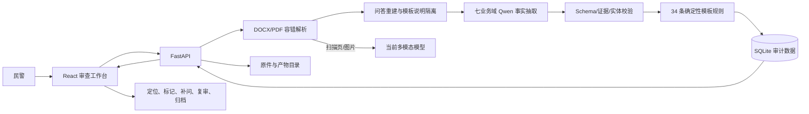

# Bilu 电信诈骗询问笔录审查技术手册

## 1. 产品与边界

Bilu 是面向办案民警的单份电信网络诈骗询问笔录复核工具。输入为脱敏 DOCX/PDF，输出为模板规则审查结果、证据定位、补问记录和归档产物。

当前业务口径来自内部《询问笔录模版(1).docx》，不再把“三现四流”作为最终规则依据。模板目录 `backend/template_rules.json` 记录来源文件、SHA-256、144 个结构块、33 个问题标记和 34 条版本化规则。

明确边界：

- 不作案件定性、法律结论、责任判断或证据效力判断。
- 模型负责证据事实抽取，规则状态由程序确定性计算。
- 所有模型结果和人工处置都需要可回查原文和版本。
- 当前没有认证授权、案件系统集成、持久任务队列和自动保留/清理策略。
- SQLite 与本地产物目录是受控单机方案，正式内网部署仍需单独评审。

## 2. 系统架构



| 层 | 主要文件 | 职责 |
|---|---|---|
| 前端 | `frontend/src/App.tsx`、`TemplateReviewView.tsx` | 上传、动态规则组、原文高亮、处置、补问、产物和归档 |
| API | `backend/app/main.py` | HTTP 契约、下载、统一错误处理 |
| 编排 | `backend/app/services/review.py` | 上传/演示任务、状态、版本、受影响域复审 |
| 解析 | `parser.py`、`openxml.py`、`question_answer.py` | 容错读取、稳定锚点、问答重建 |
| 抽取 | `template_extraction.py`、`qwen.py` | 七域 strict Schema 请求、重试、实体/锚点校验 |
| 规则 | `template_rule_engine.py`、`template_rules.json` | 适用性、完整性、重复实体、金额和时间关系 |
| 持久化 | `store.py`、`artifacts.py` | 显式迁移、原件哈希、版本/事实/问题/事件/产物 |
| 报告归档 | `reports.py`、`docx_report.py`、`archive.py` | PDF/DOCX/JSON/清单和不可变归档门禁 |

## 3. 文档标准化

### 3.1 DOCX

`openxml.py` 只读取必要 XML 部件，逐个隔离损坏的可选媒体，避免一个坏图片导致整份笔录无法解析。正文、表格、页眉和页脚保持来源类型与阅读顺序；图片按当前多模态识别能力转写。

DOCX 没有可靠物理页定义，页面为逻辑页。稳定段落 ID 依赖规范化可见结构和文本哈希，不依赖 ZIP 包元数据，因此同内容重新保存不会改变证据锚点。

### 3.2 PDF

文本型 PDF 使用 PyMuPDF 原生文本块，并保留 `bbox`。扫描页或文本不足的页面转为图片识别。PDF 保留原始页号；OCR 图片区域当前不承诺精确坐标。

### 3.3 统一契约

`ParsedDocument` 保留兼容的全文/分页结构，并增加：

- `DocumentWarning`：可恢复媒体/解析警告。
- `DocumentParagraph.id`：稳定证据锚点。
- 全局字符 `charStart/charEnd`。
- PDF 原生块 `bbox`。
- `QuestionAnswerBlock`：问题、回答、模板说明、锚点和清晰度。

问答有限状态解析器支持同段多标记、跨段和跨页回答。括号内模板提示进入 `guidance`，不会作为案件事实发送给模型。

## 4. 模板规则与事实抽取

### 4.1 规则目录

34 条规则分为 15 组。常规规则始终检查，条件规则需要证据支持适用性，结构规则检查笔录头、询问人员、被询问人和签名等结构。

规则可声明：

- `requiredFields`：必需事实路径。
- `appliesWhen`：证据支持的适用条件。
- `repeatEntity`：实体类型、数量路径和每项必填字段。
- `consistencyChecks`：计数、金额求和、返款净损失和时间先后。
- `sourceParagraphs/sourceMarker`：模板来源追溯。

### 4.2 七个抽取域

| 域 | 内容 |
|---|---|
| `header_procedure` | 笔录结构、权利义务和程序确认 |
| `case_timeline` | 报案原因、案情经过、时间线、隐私和动机 |
| `contact_channels` | 初始联系和渠道切换实体 |
| `risk_and_evidence` | 预警劝阻、风险操作和证据材料 |
| `online_money` | 转账、返款、损失和交易实体 |
| `offline_delivery` | 取现、现金/财物线下交付实体 |
| `special_scenarios` | 赌博、电商物流冒充和补充陈述 |

每个域生成固定 JSON Schema。模型必须返回该域所有事实路径、实体数组和 `failedDomains`。clear/unclear/unknown 事实必须引用实际短锚点，missing 不得引用。短锚点只存在于请求内，响应校验后恢复为真实段落 ID。

抽取温度为 0；当前模型固定为项目配置的 `Qwen3.6-35B-A3B`。Schema 不支持时可使用同一 Schema 的工具调用。单域最多 3 次结构/证据/临时错误尝试，鉴权或未配置错误直接失败。

### 4.3 确定性校验

`template_rule_engine.py` 不调用模型。它依据事实清晰度、适用条件、实体数量、字段、金额与时间计算：

`covered`、`missing`、`incomplete`、`inconsistent`、`not_applicable`、`needs_manual_review`。

初次规则计算后，只对适用性仍不明确的事实路径发起 focus-only 定向复核。定向请求按域过滤路径，并使用缩小后的 Schema，不返回无关事实或实体。

## 5. 持久化与审计

SQLite 使用显式 schema version 和幂等迁移。核心记录包括：

- document 与 document version；
- model run、fact 与 issue；
- append-only operator event；
- artifact 元数据与哈希；
- 兼容旧任务 JSON 的历史读取。

原件使用受控文件名和内容 SHA-256 保存，写入采用临时文件加原子替换，读取时重新校验哈希。路径必须位于配置的产物根目录内。

人工操作不覆盖历史事件。补问答案创建新文档版本，并只复审受影响业务域；未受影响域沿用上一版本事实。

## 6. 民警工作流

1. 上传或选择脱敏演示笔录。
2. 查看 15 个动态规则组和状态统计。
3. 选择问题后，文档窗格按精确锚点定位并高亮原文。
4. 对问题执行确认、忽略、加入补问或其他允许动作。
5. 输入实际补问答案，生成新版本并重新审查受影响域。
6. 生成 PDF、DOCX、JSON 和 manifest。
7. 通过归档门禁，进入不可变只读状态。

归档会阻止以下状态：失败业务域、未确认警告、待处理高风险问题、缺失必需产物、产物哈希异常。归档后所有修改接口返回冲突错误。

## 7. 产物

| 类型 | 内容 |
|---|---|
| Review PDF | 任务/版本、规则摘要、问题、证据、补问和操作记录 |
| Follow-up DOCX | 可继续询问和填写答案的补问文档 |
| Review JSON | 机器可读的完整审查数据 |
| Manifest JSON | 文件名、类型、大小、SHA-256、规则/模型/解析版本 |

产物重新生成会使旧产物失效。归档清单重新计算所有哈希，防止文件被替换后继续归档。

## 8. API 生命周期

核心接口：

- `POST /api/v1/reviews`：上传并创建任务。
- `GET /api/v1/reviews/{task_id}`：读取任务和审查状态。
- `GET /api/v1/reviews/{task_id}/versions`：版本链。
- `POST /issues/{rule_id}/actions`：人工处置。
- `POST /issues/{rule_id}/follow-up-answer`：补问答案和域级复审。
- `POST /domains/{domain}/retry`：失败域重试。
- `POST /warnings/acknowledge`：确认可恢复警告。
- `POST /artifacts/generate` 与 `GET /artifacts/{artifact_id}`：生成/下载产物。
- `POST /archive`：执行门禁并归档。

准确请求/响应结构以 `docs/openapi.json` 为准。前端 `types.ts` 和 `api.ts` 是主要 TypeScript 消费者。

## 9. 质量与性能门禁

`generate_template_gold_cases.py` 生成两层脱敏质量语料：12 组覆盖 92 个事实路径的契约 DOCX/PDF，以及 4 组由人工静态标注的自然语言文档变体（完整、漏问、回答不清、金额矛盾），自然案例同时走 DOCX 和 PDF 真实模型抽取。另有 136 个规则引擎变体。全部材料扫描禁止完整身份证号、手机号、银行卡号、URL 和公网 IP 形态。

契约语料用于验证 Schema、路径、实体和规则引擎组合，不单独作为自然语言理解能力的证明。自然案例正文不包含内部事实路径或 `VALUE_TEST_`/`ENTITY_TEST_` 令牌，规则期望与事实期望为手写 oracle，避免由生产规则引擎反算后自证。

`verify_template_quality.py` 包含两层门禁：

- offline：解析、问答、字段、实体、锚点、适用性、规则、误报、稳定性和敏感扫描。
- live：使用当前模型连续运行，比较 92 个事实、所有实体数量/字段、34 条规则状态、锚点和语义稳定性。

`benchmark_template_review.py` 在最重的全业务域场景上记录解析、各域、总耗时、请求数、token、P50/P95。每个样本先过同一金标准质量门禁；候选质量指纹必须与基线一致，且 P50 或 P95 至少改善 10% 才能接受。

性能正式结果记录在 `docs/template-review-performance.md`。缓存命中不能冒充首次审查提速。

## 10. 修改影响指南

| 修改 | 必须同步检查 |
|---|---|
| 模板规则或事实路径 | `template_rules.json`、域映射、Schema、规则引擎、gold oracle、前端标签 |
| 段落 ID/分页/问答 | 解析测试、锚点校验、定位 UI、PDF/DOCX 回归 |
| 模型请求 | strict Schema 兼容、重试、日志脱敏、gold live gate、性能基准 |
| 人工状态 | API、append-only 事件、前端按钮、归档门禁、报告 |
| 产物格式 | 内容测试、manifest、下载校验、每页视觉检查 |
| 数据库 | schema version、幂等迁移、旧任务读取、事务与回滚 |

不允许通过放宽 Schema、锚点、实体或金标准期望来让测试通过。模型输出永远不能覆盖确定性缺失、不完整、不一致和适用性判断。

## 11. 运行与验证

```powershell
npm run dev
npm run test
npm run build
backend\.venv\Scripts\python.exe backend\scripts\export_openapi.py
backend\.venv\Scripts\python.exe backend\scripts\verify_template_quality.py --offline
```

真实模型门禁和性能命令见根目录 `README.md`。所有真实模型测试只能使用本仓库生成的脱敏语料或已经批准的脱敏材料；默认日志只记录字符数和 SHA-256，不记录完整提示和模型载荷。

## 12. 正式部署前事项

- 接入身份认证、角色权限和操作员身份来源。
- 明确数据库/产物加密、备份、保留、删除和审计制度。
- 将进程内后台任务迁移为可恢复队列，并定义幂等、取消和重放语义。
- 完成公安内网模型服务容量、并发、超时和故障演练。
- 对模板版本发布、批准、回滚和历史案件重审建立管理流程。
- 用批准的脱敏代表性样本继续补充方言、OCR、超长笔录和复杂重复实体测试。
