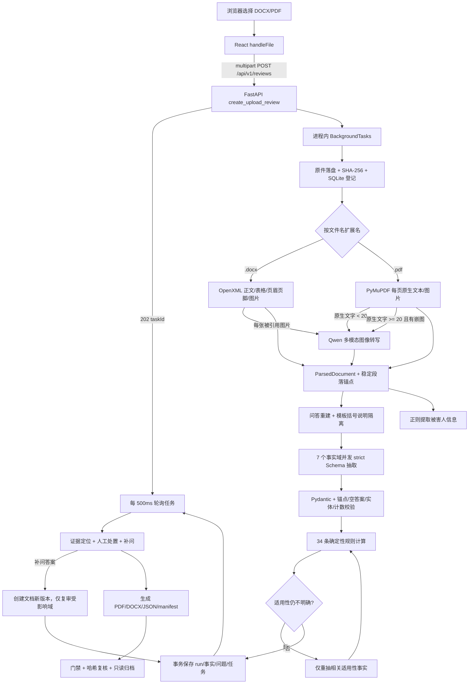
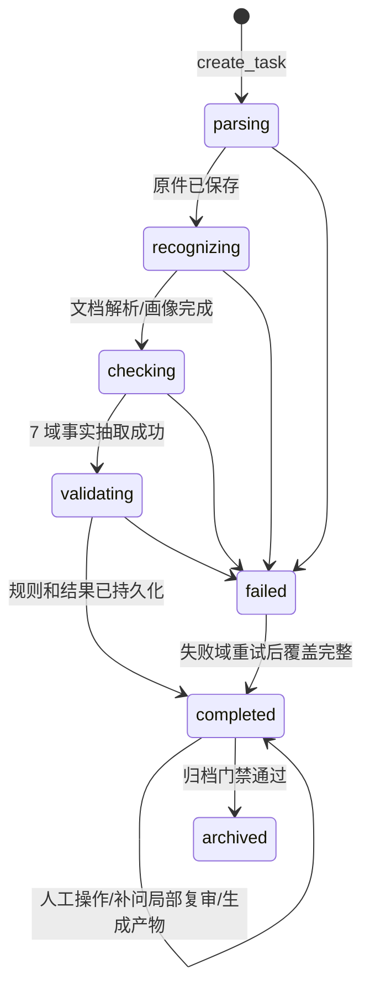

# Bilu 电信诈骗询问笔录审查技术手册

> 本手册以当前源码为准，面向需要继续开发、调试和审计该项目的工程人员。证据标签含义：`[代码确认]` 为当前源码/配置直接证明；`[已执行验证]` 为本次实际运行的测试或命令证明；`[文档声明]` 为 README/需求或设计文档表达的目标；`[合理推断]` 为基于调用关系的推断；`[未验证/冲突]` 为本次无法通过本地静态代码或安全测试确认的外部行为。


首先就是我看document表似乎存储了原始文档的三种派生，是不是只需要存储一个page文档就够了？剩下俩是不是就是通过DocumentPage派生得到的？


```
 每条规则返回 COVER / NOT_APPLICABLE / NEEDS_MANUAL_REVIEW
```


```
return {
    "type": "object",#json schema约束
    "properties": {
        "facts":   { ... },    # 每个域不同（路径不同）,是每个域自己的规则点集合
        "entities": { ... },   # 每个域不同（有实体域才有内容）重复实体列表（比如多笔转账、多次取款）。没实体的域就传 {}
        "failedDomains": { ... }  # 全部一样：必须 []标记这个域是否失败。留着它是为了统一结构，正常情况必须是 []
    },
    "required": ["facts", "entities", "failedDomains"],
    "additionalProperties": false,
}
```

其中：每个facts结构如下：

clarity表示模型对valuep判断的信心

```
  facts: {
    "record.interviewers":    {value:"张三、李四", clarity:"clear", evidenceAnchorIds:["a001"]},
    "procedure.recusal_requested": {value:false, clarity:"clear", evidenceAnchorIds:["a015"]},
    "victim.name":           {value:"王五", clarity:"clear", evidenceAnchorIds:["a002"]},
    "victim.age":            {value:35, clarity:"clear", evidenceAnchorIds:["a003"]},
    "case.timeline":         {value:"2026年7月...", clarity:"clear", evidenceAnchorIds:["a020"]},
    "online_money.used":     {value:true, clarity:"clear", evidenceAnchorIds:["a035"]},
    "money.gross_loss":      {value:50000, clarity:"clear", evidenceAnchorIds:["a040"]},
    ...共 ~70 条事实
  },
  entities: {
    "transfers": [
      {id:"e1", entityType:"transfers", fields:{"time":{value:"7月18日",...}, "amount":{value:50000,...}}}
    ],
    "withdrawals": [
      {id:"e2", entityType:"withdrawals", fields:{"bank":{value:"工商银行",...}, ...}}
    ]
  }
```


业务域一：组 1：笔录元信息（`record.*`）— 4 个路径

提取笔录本身的基本信息：

| 路径                  | 含义               | 例子                    |
| :-------------------- | :----------------- | :---------------------- |
| `record.interviewers` | 询问人（民警）     | "张三、李四"            |
| `record.respondent`   | 被询问人（受害人） | "王五"                  |
| `record.location`     | 询问地点           | "XX派出所"              |
| `record.started_at`   | 开始时间           | "2026年7月18日15时30分" |
| `record.signatures`   | 签名确认情况       | "已逐页签名"            |

### 组 2：程序性权利告知（`procedure.*`）— 7 个路径

检查民警有没有履行法定告知义务：

| 路径                                    | 含义                           | 值类型  |
| :-------------------------------------- | :----------------------------- | :------ |
| `procedure.rights_notice_read`          | 是否宣读权利义务告知书         | boolean |
| `procedure.truth_notice_confirmed`      | 是否告知要如实提供证据         | boolean |
| `procedure.statement_confirmed_true`    | 被询问人是否确认陈述属实       | boolean |
| `procedure.record_matches_statement`    | 笔录是否与其陈述一致           | boolean |
| `procedure.record_reviewed`             | 被询问人是否核对过笔录         | boolean |
| `procedure.recusal_requested`           | 是否申请过回避                 | boolean |
| `procedure.key_information_reconfirmed` | 关键信息是否重新确认           | boolean |
| `procedure.rights_request`              | 被询问人行使了什么权利（文本） | string  |

### 组 3：受害人基础信息（`victim.*`）— 7 个路径

| 路径                | 含义     |
| :------------------ | :------- |
| `victim.name`       | 姓名     |
| `victim.gender`     | 性别     |
| `victim.age`        | 年龄     |
| `victim.id_number`  | 身份证号 |
| `victim.phone`      | 联系电话 |
| `victim.education`  | 文化程度 |
| `victim.employer`   | 工作单位 |
| `victim.occupation` | 职业     |


# 表结构：

## 核心表（1张）

| 表                 | 列                                 | 说明                                   |
| :----------------- | :--------------------------------- | :------------------------------------- |
| **`review_tasks`** | `id`, `updated_at`, `payload_json` | **大 JSON 表**，整条审查任务的所有数据 |

## 文档存储（2张）

| 表                      | 列                                                           | 说明                       |
| :---------------------- | :----------------------------------------------------------- | :------------------------- |
| **`documents`**         | `id`, `task_id`, `filename`, `mime_type`, `sha256`, `original_path`, `created_at` | 文档元数据 + 判重          |
| **`document_versions`** | `id`, `document_id`, `version_number`, `content_sha256`, `parsed_json`, `created_at` | `parsed_json` 列存解析内容 |

## 审查结果（3张）

| 表                    | 列                                                           | 说明               |
| :-------------------- | :----------------------------------------------------------- | :----------------- |
| **`review_runs`**     | `id`, `task_id`, `document_version_id`, `rule_version`, `model`, `status`, `timings_json`, `created_at`, `completed_at` | 每次审查执行记录   |
| **`extracted_facts`** | `id`, `run_id`, `path`, `payload_json`, `created_at`         | 模型提取的事实     |
| **`review_issues`**   | `id`, `run_id`, `rule_id`, `payload_json`, `created_at`      | 规则校验发现的问题 |

## 辅助表（2张）

| 表                  | 列                                                           | 说明                     |
| :------------------ | :----------------------------------------------------------- | :----------------------- |
| **`artifacts`**     | `id`, `task_id`, `document_version_id`, `artifact_type`, `filename`, `path`, `sha256`, `size_bytes`, `metadata_json`, `created_at` | 原始文件、导出文件等     |
| **`manual_events`** | `id`, `task_id`, `issue_id`, `event_type`, `actor_id`, `payload_json`, `created_at` | 人工干预记录（只增不删） |

## 元数据（1张）

| 表                      | 列                      | 说明               |
| :---------------------- | :---------------------- | :----------------- |
| **`schema_migrations`** | `version`, `applied_at` | 数据库版本迁移记录 |

------

**关系链**：

```
review_tasks
    → documents（一个 task 一个 document）
        → document_versions（一个 document 多个版本）
    → review_runs（一个 task 多次运行）
        → extracted_facts（一次运行的提取结果）
        → review_issues（一次运行发现的问题）
    → manual_events（人工干预）
    → artifacts（文件产物）
```


## 1. Snapshot and reading paths

### 1.1 当前快照

| 字段 | 当前值 |
|---|---|
| Repository state | `main`，提交 `0ade6d10333e90d5f9bd7623af2fb3c27721c855`（`0ade6d1 chore: restore inquiry record PDF template`）。开始检查时工作区已有用户改动：`frontend/src/styles.css`、Word 临时文件和两份 2026-07-18 设计/计划文档；本次不修改它们。`[代码确认]` |
| Scope | 全项目中的“真实文件上传后如何处理”主链，并向后追到人工处置、补问复审、产物和归档；演示/旧三现四流路径只作为边界说明。`[代码确认]` |
| Verification | 本次读取了当前 Git 状态、入口、解析器、模型请求、Schema 校验、规则引擎、存储、产物、归档和相关测试；验证命令及结果见本节末尾。`[已执行验证]` |
| 未运行 | 未调用真实 Qwen/VLM、未上传真实案件材料、未运行 live 质量门禁和性能基准；因此模型服务兼容性、真实 OCR/抽取质量和生产吞吐量均为 `[未验证/冲突]`。 |

### 1.2 三条阅读路径

- **5 分钟全景**：读第 4 节架构图、第 5.1 节逐步时序、第 8 节规则矩阵和第 9 节运行边界。
- **跟完一次真实请求**：按 `frontend/src/App.tsx::handleFile` → `frontend/src/api.ts::createUploadTask/pollReviewTask` → `backend/app/main.py::create_upload_review` → `backend/app/services/review.py::process_upload` → `parser.py::parse_document` → `template_extraction.py::run_template_review` → `template_rule_engine.py::evaluate_template_rules` → `review.py::_persist_outcome` 阅读。
- **准备修改某模块**：先看第 6 节职责表，再看第 7 节契约和第 10.4 节回归检查，不要只改调用链中的单个文件。

### 1.3 本次实际验证

本次最终验证使用以下聚焦测试，覆盖 DOCX/PDF 基础解析、问答重建、事实 Schema/锚点、确定性规则、持久化、补问和归档。测试不连接真实模型，相关调用由测试替身代替。

```powershell
cd backend
python -m pytest -q `
  tests/test_parser.py `
  tests/test_question_answer.py `
  tests/test_template_document_parser.py `
  tests/test_template_extraction.py `
  tests/test_template_rule_engine.py `
  tests/test_review_lifecycle.py `
  tests/test_archive_manifest.py
```

结果：`67 passed, 1 skipped in 4.57s`。跳过项是 `BILU_TEMPLATE_PATH` 未配置时不运行的内部模板解析条件测试；同时出现一条 `pytest-asyncio` 默认 fixture loop scope 将来会变化的弃用警告。`[已执行验证]`

项目 `backend/.venv` 运行同一命令时在测试收集阶段因缺少 `reportlab` 失败，未执行测试；系统 Python `D:\Python\python.exe` 已安装 `reportlab 5.0.0`，因此上述成功结果来自系统 Python。没有安装依赖或改变环境。`[已执行验证]`

2026-07-18 追加了模板方框专项只读检查：直接检查 `backend/询问笔录模版(1).docx` 的 `word/document.xml`、relationship 和媒体部件，并调用项目自身 `parse_document`。模板包含 56 个名为 `CheckBox*` 的 DrawingML 图片实例、4 个共享 PNG；4 个媒体部件的 ZIP central CRC 均为 0，当前解析得到 `images=0`、4 个 `media_corrupt` warning、0 个 vision paragraph。`[已执行验证]`

## 2. Goals and non-goals

### 2.1 要解决的问题

- 输入是一份**已脱敏**的 `.docx` 或 `.pdf` 询问笔录；系统把不同格式统一成可定位段落、重建问答、抽取事实，再按内部模板规则发现漏问、回答不清、数量/金额/时间矛盾等问题。`[代码确认]` `backend/app/services/parser.py::parse_document`、`backend/app/services/template_extraction.py::run_template_review`
- 输出不是模型自由文本，而是 34 条版本化规则的 `ReviewResult`、原文证据位置、被害人信息、重复实体、失败域、人工处置和可归档产物。`[代码确认]` `backend/app/models.py::ReviewTask/ReviewResult`
- 最终使用者是办案民警/复核人员；系统结果必须人工核对。`[文档声明]` `README.md`

### 2.2 支持的输入输出

| 项目 | 当前实现 |
|---|---|
| DOCX | 正文段落、表格、正文内容控件、被实际引用的页眉/页脚及被引用图片；可恢复的非关键媒体损坏会形成 warning。`[代码确认]` |
| PDF | 原生文本块及 `bbox`；每页原生文本少于 20 字时整页渲染为 2x 图片交给 VLM；原生文本足够时仍单独转写该页嵌入图片并去重合并。`[代码确认]` |
| 图片文件 | **不能作为顶层上传格式**；前端只接受 `.docx,.pdf`，后端也只按扩展名分派。图片仅作为 DOCX/PDF 内部内容进入 VLM。`[代码确认]` |
| `.doc` | 明确拒绝，返回 `unsupported_legacy_word`，要求先转换为 `.docx`。`[代码确认]` |
| 大小 | API 和解析器都检查 20 MB；API 最多读取 `20 MB + 1 byte` 来发现超限。`[代码确认]` |
| 审查结果 | 34 条规则状态、缺失事实、证据文本/位置/锚点、建议补问、严重度和人工决定。`[代码确认]` |
| 归档产物 | 原件、审查 PDF、补问 DOCX、结构化 JSON、archive manifest JSON。`[代码确认]` |

### 2.3 明确非目标

- 不作案件定性、法律结论、责任判断或证据效力判断。`[文档声明]` `README.md`
- 模型不拥有最终规则裁决权；当前模板链中模型只抽取带证据的事实和实体，状态由 Python 规则引擎计算。`[代码确认]`
- 当前没有认证、角色授权、案件系统集成、持久任务队列、取消 API、自动数据保留/删除策略。`[代码确认]`
- 当前不是“上传任意图片做 OCR”的通用识别服务；没有图片上传 API。`[代码确认]`
- `backend/app/services/qwen.py` 中仍存在旧三现四流 `review_with_qwen` 实现，但当前真实上传链只调用其中通用的 `request_structured_payload`；不能把旧函数当作当前 34 条模板规则的执行器。`[代码确认]`

## 3. Technology and solution map

| Area | Technology | Actual responsibility | Evidence | Verification/limits |
|---|---|---|---|---|
| 浏览器 UI | React 19、TypeScript、Vite、Lucide | 文件选择/拖拽、任务状态轮询、规则与证据展示、人工操作、产物下载 | `frontend/package.json`、`App.tsx`、`TemplateReviewView.tsx` `[代码确认]` | 前端 `accept` 只是选择器提示，拖拽仍需后端兜底校验。 |
| HTTP API | FastAPI 0.115.6、python-multipart | multipart 接收、202 任务创建、查询/人工/产物/归档路由、统一 `AppError` | `backend/requirements.txt`、`backend/app/main.py` `[代码确认]` | 后台任务是进程内 `BackgroundTasks`，不是外部队列。 |
| DOCX | ZIP + lxml OpenXML 读取；python-docx 用于生成补问文件/测试 | 自己读取必要 XML，以正文/表格/页眉/页脚顺序形成块，限制压缩包扩张，隔离可恢复媒体错误 | `openxml.py` `[代码确认]` | 逻辑分页按字符数，不是 Word 版式页码。 |
| PDF | PyMuPDF 1.25.1；pypdf 主要用于测试/辅助 | 原生文本块、坐标、页图渲染、嵌入图片提取 | `parser.py::_parse_pdf` `[代码确认]` | OCR/VLM 产生的文本没有精确图片区域坐标。 |
| 图像转写 | OpenAI-compatible `/chat/completions` 多模态消息 | 把扫描页或嵌入图片转成 `paragraphs + confidence` | `vision.py::transcribe_image` `[代码确认]` | 真实模型是否稳定遵守 JSON 由外部服务决定，本次未实测。 |
| 事实抽取 | 同一 OpenAI-compatible Qwen 配置、strict JSON Schema / tool fallback | 7 个领域并发抽取全部声明事实和重复实体，温度 0 | `template_extraction.py`、`qwen.py::request_structured_payload` `[代码确认]` | 这里只能说明本项目请求契约，不能声称模型内部推理方式。 |
| 规则计算 | Pydantic + Python 确定性函数 | 适用性、缺失/不清、重复实体、计数/金额/返款/时间一致性 | `template_rule_engine.py` `[代码确认]` | 业务规则正确性仍需主管部门批准。 |
| 持久化 | Python sqlite3，schema version 2 | 任务快照、原文版本、模型 run、事实、问题、追加式人工事件、产物元数据 | `store.py` `[代码确认]` | SQLite 适合受控单机；无跨进程任务调度。 |
| 文件存储 | 本地受控目录 + SHA-256 + 原子替换 | 保存原件和生成产物，下载时复算哈希 | `artifacts.py` `[代码确认]` | 未实现加密、远端对象存储和保留期。 |
| 报告 | ReportLab、python-docx、JSON | 生成 PDF、补问 DOCX、结构化 JSON 和清单 | `reports.py`、`docx_report.py` `[代码确认]` | 视觉排版需在代表性长文档上继续人工检查。 |

## 4. Architecture, data flow, and boundaries



### 4.1 进程与信任边界

- **浏览器到 API**：上传内容是不可信输入；前端限制不能替代服务端限制。`[代码确认]`
- **API 到本地文件/SQLite**：原件字节不写入 SQLite，SQLite 保存路径、SHA-256、解析 JSON 和审计记录；实际字节在 `REVIEW_ARTIFACT_ROOT`。`[代码确认]`
- **后端到模型服务**：扫描页/图片以 base64 data URL 发送；事实抽取提示包含标准化后的文档结构和问答文本。即使文件已脱敏，也必须把模型服务视为数据离开进程的外部边界。`[代码确认]`
- **后台任务边界**：创建请求返回 202 后，处理仍在 Web 进程内执行。进程崩溃时没有队列重放/恢复调度。`[代码确认]`
- 图只证明源码调用关系，不证明实际部署拓扑、网络隔离、模型提供方内部处理、数据加密或容量。`[未验证/冲突]`

## 5. End-to-end workflows

### 5.1 正常上传：从点击到结果

#### Node A：前端接收文件并创建任务

| Field | Explanation |
|---|---|
| Purpose | 建立异步任务，避免浏览器在一个长 HTTP 请求里等待 OCR 和 7 域模型抽取。 |
| Caller/callee | `NewReviewView::inputFile` → `App::handleFile` → `api.ts::createUploadTask`；随后 `completeReview` → `pollReviewTask`。 |
| Input | 浏览器 `File`。选择器提示 `.docx,.pdf`；页面要求模型健康检查为 online。拖拽本身没有扩展名预校验。 |
| Processing | `FormData` 的字段名固定为 `file`；POST 成功后保存 `taskId`，每 500 ms GET 一次任务，最多等 10 分钟。 |
| Output/state | UI 本地状态从 `uploading` → `parsing`，以后端 `ReviewTask.status` 为准；成功自动进入结果页并选择首个可处置问题。 |
| Validation owner | 浏览器只负责可用性；格式和大小的可信校验在后端。 |
| Failure/retry | 健康检查失败时 UI 不发送上传；请求/轮询失败显示统一错误；10 分钟只是前端等待上限，不会取消后台任务。 |
| Evidence | `frontend/src/App.tsx::handleFile/inputFile/completeReview`、`frontend/src/api.ts::createUploadTask/pollReviewTask` `[代码确认]` |
| Debugging | 浏览器 Network 看 POST 202 和后续 GET；检查 `task.errorCode/errorMessage`。 |
| Modification impact | 改轮询、状态名或路由时同步 `types.ts`、OpenAPI、`workflowProgress` 和错误展示测试。 |

#### Node B：API 读取、限流并安排后台处理

| Field | Explanation |
|---|---|
| Purpose | 对上传大小做第一道硬限制，创建可查询任务。 |
| Caller/callee | `POST /api/v1/reviews` → `create_task(ReviewMode.QWEN)` → `BackgroundTasks.add_task(process_upload, ...)`。 |
| Input | multipart `UploadFile`；API 读取最多 `MAX_FILE_SIZE + 1`。`content_type`只写日志，不参与解析器选择。 |
| Processing | 大于 20 MB 直接 413；否则先创建 SQLite 任务，然后把文件名和完整字节传给进程内后台函数。 |
| Output/state | 立即返回 HTTP 202 `{taskId,status}`；初始任务状态实际为 `parsing`。 |
| Validation owner | API 拥有总上传大小限制；扩展名和可解析性由 parser 再校验。 |
| Failure/retry | 请求读取/任务创建的意外异常由 FastAPI 500；没有幂等键，相同文件重复上传会产生新任务。 |
| Evidence | `backend/app/main.py::create_upload_review`、`config.py::MAX_FILE_SIZE` `[代码确认]` |
| Debugging | 日志事件 `upload.received`、`upload.task_created`；Swagger `/api/docs`。 |
| Modification impact | 改大小时同步 UI 文案、README、测试和反向代理限制；改后台模型时要评估任务恢复。 |

#### Node C：先保存原件和审计骨架

| Field | Explanation |
|---|---|
| Purpose | 在解析前固定收到的原始字节、文件名和哈希，建立后续版本/产物的来源链。 |
| Caller/callee | `process_upload` → `save_original` → `ArtifactStorage._save`；再写 `documents`、`artifacts`。 |
| Input | 不可信文件名、任务 ID、文件字节。 |
| Processing | 清理文件名非法字符；任务目录必须位于 artifact root；SHA-256 内容寻址；先写 `.tmp` 再原子替换。 |
| Output/state | `task.documentId`、原件 `ArtifactSummary`、`requiredArtifacts`；状态改为 `recognizing`。 |
| Validation owner | `ArtifactStorage` 负责路径穿越、文件名、哈希碰撞；SQLite 负责外键和任务快照。 |
| Failure/retry | 注意：**原件保存发生在格式解析之前**。扩展名不支持或内容损坏时，失败任务仍可能保留原件和 document/artifact 记录。没有自动清理。 |
| Evidence | `review.py::process_upload` 160-191 的顺序、`artifacts.py::ArtifactStorage` `[代码确认]` |
| Debugging | 查 `backend/data/artifacts/<taskId>/original`（或配置目录）和 SQLite `documents/artifacts`。不要在日志中打印原件内容。 |
| Modification impact | 调整保存顺序会改变失败任务的取证/留存语义，需明确产品与数据治理决定。 |

### 5.2 DOCX 解析分支

| Field | Explanation |
|---|---|
| Purpose | 在不依赖 Word 排版引擎的情况下，稳定读取案件可见内容并避免恶意/损坏 ZIP 拖垮进程。 |
| Caller/callee | `parse_document` 按 `.docx` → `_parse_docx` → `read_docx_parts`；图片 → `transcribe_image`。 |
| Input | 最多 20 MB 的 DOCX ZIP 包。后端按**文件名扩展名**而非 MIME/magic 判断。 |
| Processing | 限制 2048 个成员、64 MB 总展开、32 MB 单成员、压缩比 200、64 张图片；读取 `word/document.xml`，按正文段落/表格顺序提取；读取实际引用的页眉页脚和图片，忽略未引用隐藏部件。 |
| Output/state | `OpenXmlDocument.blocks/images/warnings`；正文块来源是 `native_text/table/header/footer`。图片转写块来源是 `vision`。所有块随后逻辑分页、生成锚点。 |
| Validation owner | OpenXML 层负责包安全与必要部件；parser 负责空文档、统一结构和问答重建。 |
| Failure/retry | 主文档 ZIP/XML 无法读取 → `parse_failed`；可选页眉/页脚损坏 → `part_corrupt` warning；不支持图片 → `media_unsupported` warning；非关键图片损坏 → `media_corrupt` warning。图片 VLM 调用失败会使整个任务失败，目前没有“跳过图片继续”的降级。 |
| Evidence | `openxml.py::_validate_package/read_docx_parts`、`parser.py::_parse_docx` `[代码确认]`; parser tests `[已执行验证]` |
| Debugging | 先跑 `tests/test_template_document_parser.py`；检查 warning、`sourceType`、段落顺序和 `questionAnswers`。 |
| Modification impact | 改阅读顺序或段落切分会改变锚点、事实证据和历史高亮；必须同时回归问答、模型提示、PDF/DOCX 定位。 |

**DOCX 页码要特别理解**：DOCX 没有通过 Word 渲染得到的物理页。`_paginate` 按约 1800 字符把块分为逻辑页，所以结果中的“第 N 页”是内部逻辑页，不等于 Word 打印页。`[代码确认]`

#### 5.2.1 方框勾选与后续详细内容：当前不可靠

内部模板中的选项方框不是 `w14:checkbox` 内容控件，也不是 `□/☑` 文本字符，而是 56 个 `w:drawing` picture 实例，名称为 `CheckBox1...CheckBox62`，反复引用 4 个 PNG 媒体部件。`[已执行验证]`

当前实现有三层信息损失：

1. 模板内 4 个 PNG 的 central CRC 都是 0；`openxml.py::read_docx_parts` 按 ZIP CRC 读取时将它们全部记为 `media_corrupt` 并跳过。因此该模板当前解析结果是 4 条 warning、`images=0`、`vision_blocks=0`，不会调用 VLM 识别这些方框。`[已执行验证]`
2. 即使实际填写件重新保存后 CRC 正常，`openxml.py::_referenced_parts` 也会按媒体 part 去重，只保留唯一图片文件；`parser.py::_parse_docx` 再把图片转写结果统一追加到所有原生文本之后。56 个“方框出现位置 → 旁边选项”关系不会进入 `ParsedDocument`。`[代码确认]`
3. 方框旁边和后面的详细文字仍作为 `w:t` 原生文本提取，但因为选择状态丢失，问答重建会把未选选项也并入答案。对当前空模板的实测中，“首次接触方式”问答被重建为 257 字、30 个锚点，同时含电话、多个聊天软件、网站、APP、物流等所有候选项；模型无法据此区分真正勾选项。`[已执行验证]`

因此当前系统只能说“详细文字大概率仍能被读取”，不能说“详细文字能可靠绑定到被勾选的方框”。这会直接影响 `contact.*`、`online_money.*`、`offline.*` 等事实的适用性和重复实体判断，可能造成误报、漏报或把模板候选项当成案件事实。`[代码确认]`

这个问题不能只靠增强 VLM prompt 修复。正确的修改边界应是：OpenXML 读取时按 run/paragraph 的原始顺序保留每个 drawing occurrence，解析每个方框的状态，并生成结构化选项，例如 `optionLabel/checked/detail/anchorId`；问答重建和模型 prompt 只发送已选项及其详细内容，同时保留未选项作为结构而非案件答案。若实际填写软件把“勾选”保存为替换后的图片，还需要用一份真实脱敏填写件确认空框/勾选图片的编码方式。`[合理推断]`

在修复前，含这类方框的真实文件不应被当作已可靠覆盖的审查输入；至少应产生阻断性 warning 并要求人工核对原文。`[合理推断]`

### 5.3 PDF 解析分支

| Field | Explanation |
|---|---|
| Purpose | 同时处理文本型、扫描型和混合 PDF，并保留原生文字坐标。 |
| Caller/callee | `parse_document` 按 `.pdf` → `_parse_pdf` → PyMuPDF；必要时 `transcribe_image`。 |
| Input | PDF 字节；加密 PDF 直接拒绝。 |
| Processing | 每页按 `(bbox.y,bbox.x)` 排序原生文本块；每个块转成标准段落并保留 bbox。计算本页原生文本字符数：小于 20 时，整页以 2x 分辨率渲染为 PNG 交给 VLM，并用 VLM 结果替换原生块；否则保留原生块，并对本页每个唯一 xref 嵌入图片调用 VLM，按规范化文本去重合并。 |
| Output/state | 保留 PDF 原始页号；原生段落有 `bbox`，VLM 段落有 `confidence`、通常无 bbox。 |
| Validation owner | PyMuPDF 负责文件结构；parser 负责文本阈值、图文合并、空结果。 |
| Failure/retry | 加密/损坏 → `parse_failed`；整份没有可用文本 → `empty_document`；任一需要的 VLM 调用失败 → 整个任务失败。 |
| Evidence | `parser.py::_native_pdf_blocks/_parse_pdf` `[代码确认]`; `test_api.py::test_scanned_pdf_uses_multimodal_transcription/test_mixed_pdf_keeps_native_text_and_transcribes_embedded_images` 已存在，但本轮未执行 `[未验证/冲突]` |
| Debugging | 看 `parser.pdf_page_ocr`、`parser.pdf_embedded_image`、`parser.pdf_page_complete`；检查 `native_chars/images/sources`。 |
| Modification impact | 修改 20 字阈值、渲染倍率或图文合并会改变费用、时延、重复文字和证据定位，必须用扫描/混合/文本三类 PDF 回归。 |

### 5.4 VLM 什么时候用、做什么、不做什么

触发条件只有三类：

1. DOCX 中被正文或实际引用页眉/页脚关系引用、且媒体格式受支持的图片，每张调用一次。
2. PDF 某页原生文本总长度 `< 20`，把整页渲染为图片调用一次。
3. PDF 某页原生文本 `>= 20` 且含嵌入图片，对每个唯一 xref 图片调用一次。

`vision.py::transcribe_image` 把图片 base64 编成 data URL，向 `{QWEN_BASE_URL}/chat/completions` 发送一条多模态 user message，`temperature=0`，要求只返回：

```json
{"paragraphs": ["按阅读顺序的可见文字"], "confidence": 0.0}
```

服务端只校验 JSON 可解析、`paragraphs` 为字符串数组、`confidence` 在 0..1。它不会在这里抽案件事实、不会计算规则状态、不会核验每个 OCR 字符与图像一致，也没有重试循环。网络超时配置为总 60 秒、连接 5 秒，失败直接传播到上传任务。`[代码确认]`

**不要混淆**：页面上写“Qwen 多模态”，是因为同一配置既可能接收图片，也用于后续文本结构化抽取；纯文本 DOCX/PDF 没有图片时不会发生 VLM 图像请求，但仍会发生 7 域 Qwen 事实抽取。`[代码确认]`

### 5.5 标准化、稳定锚点与问答重建

| Field | Explanation |
|---|---|
| Purpose | 把 DOCX/PDF/VLM 的异构输出统一为模型、规则和 UI 都能引用的稳定证据单元。 |
| Caller/callee | parser → `_finalize_pages` → `reconstruct_question_answers`。 |
| Input | 有页序和来源类型的 `DocumentParagraph` 列表。 |
| Processing | 规范化空白；根据全部可见内容生成 document digest；每段 ID 再哈希 digest、页、段序、来源、文本，截取 24 位；计算全文 `charStart/charEnd`。问答状态机识别同段/跨段/跨页 `问：/答：`，直到下一问结束。 |
| Output/state | `ParsedDocument.pages/text/warnings/questionAnswers`；问答块含 question、answer、guidance、anchorIds、answerClarity。 |
| Validation owner | parser 拥有段落和字符范围；question_answer 拥有语义问答边界。 |
| Failure/retry | 无有效块时 `empty_document`。问答识别失败不会单独报错，可能得到空/不完整 `questionAnswers`，后续事实更可能 missing。 |
| Evidence | `parser.py::_finalize_pages`、`question_answer.py::reconstruct_question_answers` `[代码确认]`; 相关 tests `[已执行验证]` |
| Debugging | 先打印**脱敏样本**的 page/paragraph/id/char range，再看 questionAnswers；不要直接从模型输出反推 parser 是否正确。 |
| Modification impact | 段落 ID 是证据、事实和 UI 高亮的连接键；任何切分/顺序/哈希变更都是数据契约变更。 |

括号内文字由 `_without_guidance` 移入 `QuestionAnswerBlock.guidance`，发送给事实模型的问答字符串只包含清理后的 question/answer。目的在于防止内部模板提示或填写示例被模型误当成案件事实。`[代码确认]`

### 5.6 被害人基础信息：不走模型

解析完成后，`extract_victim_profile(task.document.text)` 用正则和跨行表格标签提取姓名、性别、年龄、民族、身份证号、工作单位、住址、联系电话。全部失败时返回 `None`，UI 不显示卡片。该卡片和 34 条规则所需的 `victim.*` 模型事实是两套用途不同的数据：前者用于展示，后者进入规则引擎；不能假设二者自动一致。`[代码确认]`

### 5.7 Qwen 事实抽取：模型到底做什么

#### 输入拆成 7 个领域

| Domain | 主要事实/实体 |
|---|---|
| `header_procedure` | 笔录结构、程序告知、被害人基本字段 |
| `case_timeline` | 报案原因、完整经过、时间、隐私、动机 |
| `contact_channels` | 初始联系、渠道切换；`contact_switches` 实体 |
| `risk_and_evidence` | 反诈宣传、预警、风险操作、证据材料 |
| `online_money` | 线上资金、损失；`transfers`、`rebates` 实体 |
| `offline_delivery` | 取现/线下交付；`withdrawals`、`offline_handoffs` 实体 |
| `special_scenarios` | 赌博、电商物流冒充、补充陈述 |

这些事实路径不是手写第二份列表：`DOMAIN_FACT_PATHS` 在模块加载时从 `template_rules.json` 的 `requiredFields`、`appliesWhen`、repeat count 和 consistency paths 汇总，再映射到领域。`[代码确认]`

#### 提示如何构造

- 每个真实段落 ID 在请求内缩短为 `A001`、`A002`，降低模型复制长哈希出错概率；响应后恢复真实 ID。
- 问答块以“问题 + 清理后的答案 + 其锚点”发送；不属于问答的结构段落单独发送。
- 明确要求模型“只抽事实，不判断规则状态，不补写、不推测”。
- 所有声明事实路径必须返回；缺失也必须显式返回 `clarity=missing`。
- `clear/unclear/unknown` 必须引用真实锚点；`missing` 不得引用。
- 转账、返款、取现、渠道切换、线下交付按独立实体保留，不能合并。

#### strict JSON 返回内容

每个事实都是：

```json
{
  "value": "任意受限标量或 null",
  "clarity": "clear | unclear | unknown | missing",
  "evidenceAnchorIds": ["A001"]
}
```

实体具有域内唯一 `id`、固定 `entityType` 和固定字段集合。顶层必须恰好有 `facts`、`entities`、空数组 `failedDomains`，不允许额外字段。优先用 `response_format.type=json_schema` 且 `strict=true`、`temperature=0`；接口明确不支持 strict Schema 时，才降级为一次强制 tool call，参数仍是同一 Schema。`[代码确认]`

#### 并发、超时和重试

- 默认 `DEFAULT_DOMAIN_CONCURRENCY=7`，7 域通过 `asyncio.gather(..., return_exceptions=True)` 并发；信号量允许以后降低并发。
- 每域客户端总超时 240 秒、连接 5 秒。
- 每域最多 3 个 attempt。任何请求、Schema、证据或实体校验的 `AppError`（配置/鉴权除外）会把错误码、字段和 correction hint 追加给模型，要求完整重做该域。
- `model_not_configured` 和 `model_auth_failed` 不重试。
- Schema 接口不支持时的 tool fallback 发生在单个 attempt 内；它不是业务结果降级。
- 最终任一域失败，抛 `TemplateDomainFailure`。成功域会合并成 partial extraction 供诊断/后续重试，但主任务 `failed`、`results=[]`，不显示部分 34 条结果。

`[代码确认]` `template_extraction.py::extract_template_facts`、`qwen.py::request_structured_payload`

### 5.8 服务端如何校验模型结果

模型 JSON 先经过 Pydantic `CaseExtraction.model_validate`，然后 `validate_domain_extraction` 做业务结构校验：

1. 事实键集合必须与该域 Schema 完全相同。
2. 短锚点恢复后必须存在于当前 `ParsedDocument`。
3. `missing` 事实不得有锚点；非 missing 必须至少一个有效锚点。
4. 若所引问答全部是 blank，不能作为案件事实证据，必须改为 missing。
5. 实体类型必须在域白名单；实体 ID 在整个域内唯一；`entityType` 必须和数组名一致。
6. `online_money/offline_delivery` 未明确适用时不得返回实体。
7. 转账/返款/取现/交付等计数字段明确时，数组长度必须精确相等。

这些校验保证“结构、引用和数量自洽”，不保证模型读取事实语义绝对正确。语义正确性仍需人工核对原文和质量语料。`[代码确认]`

### 5.9 规则提取与确定性审查结果

严格说，系统有两步：

- **规则目录加载**：启动时 `data.py` 用 Pydantic 读取 `backend/template_rules.json`。当前版本 `1.0.0`，来源模板 SHA-256 固定，包含 34 条规则/15 组。规则本身不是每次运行时从 DOCX 动态现抽；它是已经抽取并版本化的 JSON 目录。`[代码确认]`
- **规则执行**：`evaluate_template_rules(extraction, rules)` 对模型事实做纯 Python 计算，不调用模型。`[代码确认]`

单条规则算法：

1. 先算 `appliesWhen`。明确 false → `not_applicable`；无法明确 → `needs_manual_review`。
2. 遍历 `requiredFields`：missing/null → 缺失；unclear/unknown → 不清；clear 且有值 → 已覆盖。
3. 若有 `repeatEntity`，检查实体数量和每个实体必填字段。
4. 执行 `consistencyChecks`：`count_matches`、`sum_matches`、`rebate_net_loss`、`chronology`。
5. 优先级：有一致性矛盾 → `inconsistent`；有缺失且无任何清晰字段 → `missing`；部分清晰/部分缺失或不清 → `incomplete`；否则 `covered`。
6. 汇总所有事实锚点，生成 reason、suggestedQuestion、severity。

首次计算后，如果存在 `needs_manual_review`，系统只收集这些规则的 `appliesWhen.path`，生成缩小后的 focus-only Schema，再抽一次相关领域并重算全部选中规则。这不是让模型直接把状态改成“适用/不适用”，而是补充适用性事实。`[代码确认]`

### 5.10 审查结果如何从内部对象变成 UI 数据

`_review_result` 把每个 `TemplateReviewIssue` 的 anchor ID 映射回段落文本和 `(page, paragraph)`：

- `evidence`：去重后的原文段落，以换行拼接；没有证据时使用固定提示。
- `evidenceLocation`：首个位置，兼容旧消费者。
- `evidenceLocations`：全部去重位置。
- `evidenceAnchorIds`：稳定锚点，供当前 UI 精确高亮。
- `source`：模板版本 + 模型名 + “事实抽取，确定性规则校验”。
- `manualDecision`：初始 `pending`。

前端 `DocumentEvidencePane` 根据选中规则的 anchor/location 高亮文档；UI 只是结果可视化和人工操作入口，不驱动后端规则执行。`[代码确认]`

### 5.11 成功持久化与轮询结束

`_persist_outcome` 把 extraction 放入任务快照，并通过 `persist_review_outcome` 在一个 SQLite 事务中：

1. 用乐观 revision 更新 `review_tasks`。
2. 创建 `review_runs`，先标记 running。
3. 写所有事实；实体作为 `entities.<type>` 事实记录。
4. 写 34 条 `review_issues`。
5. 把 run 更新为 completed。
6. 写同事务人工事件（若有）。

任务最终 `status=completed`；浏览器下一次轮询拿到结果并停止。解析、各域和总耗时保存在 `ReviewTimings`。`[代码确认]`

### 5.12 人工处理、补问和局部复审

- 人工可执行 confirmed、supplemented、ignored、resolved、not_applicable；ignored/resolved/not_applicable 必须填写依据。事件追加写入 `manual_events`，数据库触发器禁止更新/删除这些事件。`[代码确认]`
- 任一人工决定或 warning 确认都会使旧生成产物从当前任务中失效，只保留 original，要求重新生成。`[代码确认]`
- 记录真实补问 question+answer 时，不修改原文件字节；程序把两段追加到内存 `ParsedDocument` 最后一页，重建问答，生成新的 document version。`[代码确认]`
- 规则 group 通过 `_GROUP_DOMAINS` 映射到一个事实域，只复审该域，并与旧 extraction 合并；不受影响域的人工决定保留，受影响域旧决定可能失效，当前补问规则标记 resolved。`[代码确认]`
- 模型运行期间若任务 revision 已被其他操作改变，提交时返回 `task_revision_conflict`，避免覆盖归档或其他修改。`[代码确认]`

### 5.13 产物生成和归档

`POST /artifacts/generate` 在任务完整成功后生成审查 PDF、补问 DOCX、结构化 JSON；再将原件+三类产物的文件名、类型、大小、SHA-256 和版本写入 manifest。所有文件都写受控目录并登记 SQLite。`[代码确认]`

归档前必须同时满足：任务 completed、无 failedDomains、所有解析 warning 已确认、requiredArtifacts 齐全、高风险可处置项已经 resolved/not_applicable/有理由 ignored。随后逐个从磁盘读取并复算哈希，解析 manifest，核对当前 documentVersionId 和四类哈希。成功后 `reviewStatus=archived`，所有修改/重新生成接口只读拒绝。`[代码确认]`

## 6. Module and code navigation

| Module/file | Owns | Does not own | Key symbols | Consumers | Read/test next |
|---|---|---|---|---|---|
| `frontend/src/App.tsx` | 页面状态、上传、轮询、顶层交互 | 文件可信校验、解析、规则计算 | `handleFile`, `completeReview` | 浏览器 | `api.ts`, `TemplateReviewView.tsx` |
| `frontend/src/api.ts` | HTTP 契约封装、500ms/10min 轮询 | 后台任务取消、重试策略 | `createUploadTask`, `pollReviewTask` | `App.tsx` | `backend/app/main.py` |
| `backend/app/main.py` | 路由、响应模型、HTTP 错误表面 | 业务编排细节 | `create_upload_review`, routes | 前端/Swagger | `review.py`, `test_api.py` |
| `services/review.py` | 任务状态机、上传总编排、人工/补问/重试 | DOCX/PDF 细节、事实规则算法 | `process_upload`, `_persist_outcome`, `record_follow_up_answer` | API | lifecycle tests |
| `services/artifacts.py` | 原件/产物路径、文件名、哈希、原子写/校验读 | 报告内容、保留策略 | `ArtifactStorage` | review/reports/archive | archive tests |
| `services/openxml.py` | DOCX 安全展开、可见部件和 warning | Word 物理分页、OCR | `read_docx_parts` | parser | parser tests |
| `services/parser.py` | 格式分派、PDF 策略、统一段落/锚点 | 案件事实、规则状态 | `parse_document`, `_parse_docx`, `_parse_pdf` | review | parser/question-answer tests |
| `services/vision.py` | 图片到段落 JSON | 事实抽取、规则判断 | `transcribe_image` | parser | API scanned/mixed tests |
| `services/question_answer.py` | 问答状态机、guidance 隔离、clarity | 业务适用性 | `reconstruct_question_answers` | parser/follow-up | `test_question_answer.py` |
| `services/victim_profile.py` | UI 基础信息正则提取 | 模板事实源、规则决定 | `extract_victim_profile` | review/report | victim profile tests |
| `services/template_extraction.py` | 域/Schema/prompt、并发抽取、锚点/实体校验、Issue→Result | HTTP 底层细节、规则目录批准 | `run_template_review`, `extract_template_facts`, `validate_domain_extraction` | review | extraction tests |
| `services/qwen.py` | OpenAI-compatible HTTP、strict Schema/tool fallback；另含旧审查链 | 当前 34 条规则计算 | `request_structured_payload`, `_post_completion` | template_extraction | 注意区分 `review_with_qwen` 旧路径 |
| `services/template_rule_engine.py` | 纯确定性状态和一致性计算 | 从文本理解事实 | `evaluate_template_rules` | template_extraction | rule engine tests |
| `backend/template_rules.json` | 版本化业务规则目录 | 每次上传的事实值 | 34 rules | data/engine/UI | catalog tests、来源模板 |
| `backend/app/store.py` | SQLite schema、事务、revision、审计快照 | 原文件字节 | `SqliteTaskStore`, `persist_review_outcome` | 全后端 | store/lifecycle tests |
| `services/reports.py`, `docx_report.py` | 产物内容和登记 | 归档门禁 | `generate_review_artifacts` | API | report/archive tests |
| `services/archive.py` | 门禁、磁盘/manifest 哈希复核 | 产物生成 | `assert_archive_ready`, `verify_archive_artifacts` | review | archive tests |

推荐代码阅读顺序就是本表自上而下；不要从 4.6 万字节的 `qwen.py` 开始，因为其中混有当前通用 HTTP 能力和已不驱动上传的旧三现四流路径。

## 7. Interface, data, and state contracts

### 7.1 上传和查询接口

| Contract | Shape/behavior | Evidence |
|---|---|---|
| `POST /api/v1/reviews` | multipart `file`; 202 `{taskId,status}`；实际工作在后台 | `[代码确认]` `main.py` |
| `GET /api/v1/reviews/{task_id}` | 完整 `ReviewTask`，用于轮询与恢复历史 | `[代码确认]` |
| `POST .../issues/{rule_id}/actions` | `{status,reason,actorId}` → 更新后的 result | `[代码确认]` |
| `POST .../follow-up-answer` | `{question,answer,actorId}` → 新版本和局部复审后的完整 task | `[代码确认]` |
| `POST .../domains/{domain}/retry` | 只允许失败域；成功后才恢复完整 results | `[代码确认]` |
| `POST .../artifacts/generate` | 生成/登记四类 required artifacts | `[代码确认]` |
| `POST .../archive` | 门禁、哈希、manifest 通过后只读归档 | `[代码确认]` |

### 7.2 任务状态机



`uploading` 和 `idle` 主要是前端/契约兼容状态；后端新任务从 `parsing` 开始。`recognizing` 这个名字也不等于每份文件一定调用 VLM，它覆盖整个 parser 阶段。`[代码确认]`

### 7.3 核心数据契约

| Object | 关键字段 | Source of truth / compatibility |
|---|---|---|
| `ParsedDocument` | pages/text/warnings/questionAnswers | Python Pydantic 为服务端源；TS `types.ts` 必须同步。 |
| `DocumentParagraph` | id/text/sourceType/confidence/char range/bbox | id 是证据连接键；PDF native 才有 bbox，vision 才通常有 confidence。 |
| `CaseExtraction` | facts/entities/failedDomains | strict Schema + Pydantic + deterministic validation。 |
| `ExtractedFact` | value/clarity/evidenceAnchorIds/sourceConfidence | 当前模型 Schema不要求 `sourceConfidence`，默认 None；OCR confidence 位于 paragraph。 |
| `TemplateRule` | appliesWhen/requiredFields/repeatEntity/consistencyChecks | `template_rules.json` + Pydantic。 |
| `ReviewResult` | status/missingFacts/evidence/location(s)/anchorIds/manualDecision/source/severity | `evidenceLocation` 是旧兼容首项；新代码应优先 `evidenceLocations/evidenceAnchorIds`。 |
| `ReviewTask` | revision/status/document/extractionPayload/results/failedDomains/artifacts/reviewStatus | SQLite `review_tasks.payload_json` 是聚合快照；规范化表用于审计。 |

### 7.4 重试预算、终态和恢复

- VLM 图片转写：当前无应用级重试；单请求 60s。`[代码确认]`
- 事实抽取：每域最多 3 attempt；单客户端 240s，总任务没有后端业务级总超时。`[代码确认]`
- 前端轮询：最多 10 分钟；超时不等于后端取消。`[代码确认]`
- 模型域失败：任务 `failed`，保留 partial extraction 和 failedDomains；域重试可能恢复 completed。`[代码确认]`
- 进程退出：SQLite/原件已写部分可保留，但没有启动扫描器自动继续 parsing/checking 任务。`[代码确认]`
- 幂等：读接口幂等；相同文件上传、人工事件、产物生成没有外部 idempotency key。内容寻址会复用同内容文件路径，但数据库仍可新增记录。`[代码确认]`

### 7.5 配置

| Variable | Use | Secret/data note |
|---|---|---|
| `QWEN_BASE_URL` | `/models` 健康检查、`/chat/completions` VLM/事实抽取 | 外部信任边界 |
| `QWEN_API_KEY` | Bearer 鉴权 | 不得提交或写入手册/日志 |
| `QWEN_MODEL` | 图像和事实请求的 model 名；写入结果/审计版本 | 当前 README 示例声明 `Qwen3.6-35B-A3B`，实际以环境为准 |
| `FRONTEND_ORIGIN` | CORS 唯一允许源 | 默认 `http://127.0.0.1:4173` |
| `REVIEW_DATABASE_PATH` | SQLite 文件 | 默认 `backend/data/reviews.db` |
| `REVIEW_ARTIFACT_ROOT` | 原件/产物根目录 | 默认 `backend/data/artifacts` |
| `BILU_DEBUG_LOGS` | DEBUG/INFO 日志级别 | 默认代码为 true |
| `BILU_LOG_PAYLOADS` | 是否把完整解析文本/提示/响应写日志 | 默认 false；仅批准脱敏材料才可打开 |

## 8. Validation rule matrix

| Rule | Source | Owner/layer | Trigger | Pass condition | Failure/result | Error surface | Test evidence | Human check |
|---|---|---|---|---|---|---|---|---|
| 文件总大小 ≤20 MB | `config.py` | API + parser | 每次上传/解析 | 字节数不超过限制 | 拒绝 | 413 `file_too_large` | API tests（相关全套未单列本轮） | 反向代理是否也允许 20 MB |
| 顶层格式 DOCX/PDF | filename suffix | parser | `parse_document` | `.docx`/`.pdf` | `.doc` 专用提示，其余拒绝 | 415 | `test_legacy_doc_is_rejected...`（源码证据，本轮未跑该文件全部） | 是否要增加 magic/MIME 校验 |
| DOCX 安全展开 | OpenXML 常量 | openxml | 打开 DOCX | 成员/展开/压缩比/图片数在阈值内 | 拒绝 | 422 `docx_expansion_limit` | `[已执行验证]` parser tests | 阈值是否符合正式部署容量 |
| 可选 DOCX 媒体 | OpenXML relationship | openxml | 读取页眉/页脚/图片 | 可读且支持 | warning 后继续或不支持跳过 | warning | `[已执行验证]` corrupt media tests | 哪些 warning 必须阻断而非确认 |
| PDF 可读/未加密 | PyMuPDF | parser | 打开 PDF | 可打开且无需密码 | 拒绝 | 422 `parse_failed` | parser/API source | 是否支持合法加密文档解密流程 |
| PDF VLM 阈值 | `<20 native chars` | parser | 每页 | ≥20 用原生文本，否则整页 VLM | VLM 失败则任务失败 | 503/502 进入 task error | 代码确认；对应 API tests 本轮未执行 | 20 字是否经代表性样本批准 |
| VLM JSON | prompt contract | vision | 每次图像请求 | paragraphs 字符串数组，confidence 0..1 | 拒绝响应 | 502 `invalid_vision_response` | 静态代码；真实服务未验证 | OCR 置信度是否要设阻断阈值 |
| 事实键完整 | 动态 domain Schema | JSON Schema + validator | 每域 | 恰好全部预期 path | 纠错重试，最多 3 次 | `invalid_model_schema` → domain failure | `[已执行验证]` extraction tests | 事实路径与规则版本是否同步批准 |
| 事实证据锚点 | 当前 document anchors | validator | 非 missing fact | 至少一个真实锚点 | 纠错重试 | `invalid_model_evidence` | `[已执行验证]` invalid anchor tests | 抽取语义是否确由该原文支持 |
| 空答案不可作证据 | QA clarity | validator | anchor 连到问答 | 至少一块不是 blank | 要求 missing | `invalid_model_evidence` | `[已执行验证]` guidance/blank tests | “不知道”应是 unclear 还是 unknown |
| missing 不带锚点 | Schema policy | validator | clarity=missing | anchor list 为空 | 纠错重试 | `invalid_model_evidence` | `[已执行验证]` | 无 |
| 实体白名单/唯一 ID | domain entity schema | validator | 返回重复实体 | 类型合法、域内 ID 唯一、字段固定 | 纠错重试 | `invalid_model_schema` | `[已执行验证]` entity tests | 实体 ID 只要求域内唯一是否足够 |
| 实体适用性 | `online_money.used/offline.used` | validator | 返回资金/交付实体 | applicability clear true | 纠错重试 | `invalid_model_schema` | `[已执行验证]` applicability test | 混合场景的边界样本 |
| 计数=实体数 | catalog count paths | validator + rule engine | 计数 clear | 数组长度相等 | 抽取阶段重试；规则阶段可 inconsistent | 502 或 result status | `[已执行验证]` extraction/engine tests | 明确“约三次”等模糊数量策略 |
| 条件规则适用性 | `appliesWhen` | rule engine | conditional rule | 条件 clear 并可计算 | false→N/A；unknown→manual review | result status | `[已执行验证]` rule tests | 业务是否接受 focus recheck 一次 |
| 必需事实完整 | `requiredFields` | rule engine | applicable rule | 全部 clear 且有值 | missing/incomplete | result status | `[已执行验证]` rule tests | 字段优先级和严重度 |
| 金额/计数/时间一致 | `consistencyChecks` | rule engine | 值均可计算 | sum/net/count/time 顺序一致 | inconsistent | result status | `[已执行验证]` rule tests | 容差、币种、日期缺省时区 |
| 归档完整性 | lifecycle policy | archive | archive | 完整任务、warning 确认、产物/高风险闭环、哈希一致 | 拒绝 | 精确 409 code | `[已执行验证]` lifecycle/archive tests | ignored 高风险的理由审批要求 |

规则优先级：上传/API 硬约束先于 parser；parser 成功后才有模型 Schema；模型结构通过后才有规则状态；人工决定不覆写自动状态，而是并列保存在 `manualDecision`；归档最后综合自动状态、人工闭环、warning 和产物完整性。`[代码确认]`

## 9. Errors and runtime characteristics

| Concern | Status | Current behavior/evidence |
|---|---|---|
| Invalid input | implemented | 大小、扩展名、DOCX 包、PDF 加密/损坏、空内容有明确错误。MIME/magic 未校验。 |
| Model unavailable | implemented | 健康检查 3s；VLM/抽取使用 `trust_env=False`；网络/HTTP/鉴权映射 AppError。 |
| Timeouts | partially implemented | 健康 3s、VLM 60s/5s connect、事实 240s/5s connect、前端 10min；后端无总业务 deadline。 |
| Retries | partially implemented | 事实域最多 3 次 + Schema→tool fallback；VLM 无重试；上传无自动任务重放。 |
| Fallback | partially implemented | strict Schema 不支持时强制 tool call；这仍要求同一结构，不产生宽松文本结果。OCR 无本地 fallback。 |
| Partial result | implemented as atomic UI result | 域失败保存 partial extraction 诊断，但 `results=[]`、task failed；重试补齐后才完成。 |
| Cancellation | not found | 前端关闭/轮询超时不会取消后台任务；无取消端点。 |
| Idempotency | partially implemented | 文件内容寻址/哈希可防替换；业务请求无 idempotency key。 |
| Concurrency | implemented within one task | 7 域默认并发；SQLite revision 防并发覆盖；SQLite 写竞争/多 worker 能力未做生产验证。 |
| Persistence/recovery | partially implemented | 任务、版本、run、事实、issue、events、artifacts 持久化；无崩溃任务自动恢复器。 |
| Retention/deletion | not found | 无自动保留、删除、案件级清理或用户删除接口。 |
| Authentication/authorization | not found | actorId 默认 `local-operator`，来自客户端输入/固定值，不是可信身份。 |
| Privacy | partially implemented | 默认 payload 日志仅 chars/SHA-256；但原件、解析 JSON、事实和产物落本地，且图像/文本发送模型服务。无加密/脱敏器。 |
| Observability | implemented for development | 旋转日志 10 MB × 5，含 task_id、阶段、各域耗时、usage；默认不记录全文。 |
| Performance | measured by repository scripts | 有 offline/live quality gate 和 benchmark；本次未运行真实模型，不能确认当前环境表现。 |

### 9.1 一个重要的状态命名误区

`process_upload` 在调用整个 `parse_document` 前就把任务设为 `recognizing`。因此 UI 的“正在识别图像文字”并不保证此时真的有图片/VLM 调用；纯文本 DOCX/PDF 同样经过该状态。随后 `checking` 包含 7 域模型事实抽取，`validating` 在当前代码中是在 `run_template_review` 已经完成规则计算后才设置，主要代表结果落库前的阶段标识。若需要精确实时进度，现有状态粒度并不完全对应内部步骤。`[代码确认]`

### 9.2 日志和敏感数据

`log_payload` 默认只记 `label/chars/sha256`。设置 `BILU_LOG_PAYLOADS=true` 才会把完整解析文本、提示、模型响应和结果写 `backend/logs/development.log`。这对调试有用，但会显著扩大敏感数据落盘面，只能用于批准的合成/脱敏材料。`[代码确认]`

## 10. Usage, debugging, and safe modification

### 10.1 启动与基本检查

```powershell
# 安装依赖（首次）
npm install
npm --prefix frontend install
python -m venv backend\.venv
backend\.venv\Scripts\python.exe -m pip install -r backend\requirements.txt

# 配好 backend/.env.local 后启动
npm run dev

# 前端 http://127.0.0.1:4173
# API  http://127.0.0.1:8787/api/v1
# Swagger http://127.0.0.1:8787/api/docs
```

先请求 `/api/v1/health`。`qwen.configured=true` 只表示三个配置项非空，`reachable=true` 表示 3 秒内 `/models` 返回 2xx；它不证明多模态、strict Schema 或当前 model 名真正可用。`[代码确认]`

### 10.2 跟一份脱敏文件调试

1. 浏览器 Network 确认 POST 返回 202 和 taskId。
2. 查日志 `upload.received` → `review.started` → `parser.*` → `template_extraction.*` → `review.model_complete` → `review.finished`。
3. 若 parser 失败，先看扩展名、大小、OpenXML warning/PDF 加密，不要先查规则。
4. 若 VLM 失败，确认是 DOCX 图片、PDF 扫描页还是混合 PDF 嵌图触发；看 media type/bytes，不打开 payload 日志处理真实材料。
5. 若某域失败，看 `failedDomains`、`template_extraction.domain_failed` 和 correction code；partial extraction 只用于定位已成功域。
6. 若结果证据不对，从 `ReviewResult.evidenceAnchorIds` 反查 `ParsedDocument.pages[].paragraphs[].id/text`，再检查 extraction fact，而不是先改 UI。
7. 若规则状态不对，分别判断“模型事实错”还是“规则算法/目录错”；这是两个不同修复位置。

### 10.3 常见错误定位

| Symptom/code | First inspection |
|---|---|
| `unsupported_format` | 文件名扩展名；当前不看 MIME/magic |
| `docx_expansion_limit` | ZIP 成员数、展开大小、压缩比、图片数 |
| `media_corrupt/media_unsupported` | task.document.warnings；确认后才能归档 |
| `model_not_configured` | `.env.local` 三项是否加载，不输出 key |
| `model_unreachable` | 当前进程到 base URL；代码 `trust_env=False` 不走系统代理 |
| `invalid_vision_response` | 模型是否按 paragraphs/confidence JSON 返回 |
| `invalid_model_schema` | domain Schema、事实键、实体字段/数量、provider strict 支持 |
| `invalid_model_evidence` | 短锚点恢复、空答案、missing 锚点规则 |
| `template_domain_failed` | 该域已用尽 3 次；任务保持原子失败 |
| `task_revision_conflict` | 补问/重试期间有并发人工操作或归档 |
| `archive_*` | warning、failedDomains、高风险 manualDecision、required artifacts、manifest/hash |

### 10.4 安全修改清单

| 修改点 | 同步修改/验证 |
|---|---|
| 上传格式/大小 | 前端 accept/文案、API/parser、OpenAPI、错误展示、原件留存顺序测试 |
| DOCX 块顺序或分页 | stable ID、字符范围、问答重建、模型锚点、UI 高亮、历史兼容 |
| PDF OCR 阈值/倍率 | text/scanned/mixed 三类、调用次数、bbox/vision 来源、质量与耗时基准 |
| VLM prompt/响应 | response parser、超时/重试、敏感日志、真实脱敏 OCR gold 样本 |
| 新事实路径 | `template_rules.json`、domain 映射、Schema、prompt、gold oracle、标签 |
| 新实体/字段 | `DOMAIN_ENTITY_FIELDS`、适用性/count path、validator、rule engine、UI 实体摘要 |
| 规则状态算法 | engine tests、归档 actionable 集合、前端筛选/标签、报告 |
| 证据定位 | ParsedDocument、alias restore、validator、ReviewResult、DocumentEvidencePane |
| 补问 | group→domain 映射、版本、revision、人工决定失效规则、产物失效 |
| 数据库 | schema version/幂等迁移、旧 payload 读取、事务、并发 revision |
| 产物/归档 | report contents、manifest type/hash、下载校验、归档门禁 |

不要通过放宽 Schema、允许不存在的锚点、删除实体数量校验或修改金标准期望来“修复”模型失败；先确定事实契约是否真要变。

## 11. Current change impact and human confirmation

本次只更新此技术手册，不改业务代码。开始时发现的用户工作区改动均保持不动。

| Changed area | Direct behavior change | Transitive impact | Evidence | Regression checks | Human decision |
|---|---|---|---|---|---|
| `docs/project-technical-guide.md` | 无运行时行为变化；补全当前上传全链说明 | 开发人员对 VLM/事实/规则/持久化边界的理解 | 当前源码和聚焦测试 | 文档路径/符号复核、相关 tests | 确认本手册是否作为后续模板/规则变更的必更文档 |

需要产品/业务/部署负责人明确的事项：

1. **失败上传原件留存**：格式错误或解析失败时原件已经落盘，是否符合保留/删除制度？
2. **后端格式真实性**：是否要在扩展名之外增加 MIME/magic 校验？
3. **图片失败策略**：一个非关键嵌图 VLM 失败是否应阻断整份审查，还是形成 warning 后继续？
4. **PDF OCR 阈值**：`native_length < 20` 和 2x 渲染是否经过代表性扫描件质量/费用评估？
5. **VLM 置信度**：当前只展示/保存 confidence，不设置低置信度 warning 或门禁，是否足够？
6. **真实身份**：`actorId=local-operator` 不是认证身份，正式审计前必须接入可信用户来源。
7. **规则批准**：34 条 JSON 已有来源哈希，但自动化验证不等于业务主管批准当前规则、严重度和建议补问。
8. **任务恢复**：正式部署前是否接受 Web 进程内后台任务，还是需要持久队列、取消、重放和崩溃恢复？
9. **方框输入门禁**：在方框 occurrence/state/label/detail 结构化解析完成前，是否直接阻断此类 DOCX 的自动审查，而不是仅以 `media_corrupt` warning 允许继续？
10. **真实填写样本**：提供一份已脱敏、至少包含“一个已勾选项 + 该项详细内容 + 一个未勾选项”的真实填写 DOCX，用于确认 Word/WPS 实际保存勾选状态的 XML/媒体编码。

## 12. Unknowns, conflicts, and evidence index

### 12.1 未知与冲突

- `[未验证/冲突]` 本次没有连接真实 `QWEN_BASE_URL`，无法确认当前配置模型同时支持图片、strict JSON Schema、tool calling、7 路并发和 240 秒请求。
- `[未验证/冲突]` 没有用真实批准案件样本验证 OCR、事实语义、方言/口语、超长笔录或复杂表格表现。
- `[代码确认]` README 把当前模型示例写成 `Qwen3.6-35B-A3B`，但 `.env.example` 是占位符；实际运行模型只能从当前环境/health 确认，不能从仓库静态断言。
- `[代码确认]` `qwen.py` 顶部和大量函数仍描述旧“三现四流”审查；当前模板链只调用其通用 HTTP/structured payload 部分。这是代码导航噪音，未来可在单独任务中拆分，但本次不做无关重构。
- `[代码确认]` `TaskStatus.RECOGNIZING/VALIDATING` 的 UI 文案比实际阶段更绝对：recognizing 未必调用 VLM，validating 设置时规则计算已经完成。
- `[代码确认]` 被害人 UI 正则画像和模板抽取 `victim.*` 是两套数据，当前没有一致性检查。
- `[代码确认]` 补问产生的是解析文档新版本，不会反写原 DOCX/PDF；下载的 original 仍是初始原件，补问内容体现在新 parsed version、事件和生成产物中。
- `[代码确认]` 没有顶层图片上传、没有 VLM retry、没有 OCR 坐标级定位保证、没有自动数据清理。
- `[已执行验证]` 当前内部模板的 56 个方框 occurrence 不进入 `ParsedDocument`，4 个共享 PNG 均因 CRC 异常被跳过；旁边选项文字会被保留，但选择状态和选项到详细内容的绑定丢失。
- `[未验证/冲突]` 尚未取得真实脱敏填写件，不能确认 Word/WPS 在用户点击方框后是替换图片、新增 relationship、写控件状态还是采用其他编码；修复前必须先检查真实产物，而不是只针对空模板猜测。

### 12.2 Evidence index

| Evidence | Proves |
|---|---|
| `frontend/src/App.tsx::handleFile/completeReview/NewReviewView::inputFile` | 上传入口、模型健康门、轮询后展示 |
| `frontend/src/api.ts::createUploadTask/pollReviewTask` | multipart、500ms、10min |
| `backend/app/main.py::create_upload_review` | 20 MB read、202、BackgroundTasks |
| `backend/app/services/review.py::process_upload` | 原件→解析→画像→模型→规则→持久化状态顺序 |
| `backend/app/services/artifacts.py::ArtifactStorage` | 安全路径、内容哈希、原子写、读取校验 |
| `backend/app/services/openxml.py::_validate_package/read_docx_parts` | DOCX 安全与可见内容/媒体 warning |
| `backend/询问笔录模版(1).docx::word/document.xml/relationships/media` | 56 个图片方框、4 个共享且 CRC 异常的 PNG `[已执行验证]` |
| `backend/app/services/parser.py::_parse_docx/_parse_pdf/_finalize_pages` | DOCX/PDF/VLM 分支、页/段/锚点 |
| `backend/app/services/vision.py::transcribe_image` | VLM 请求、prompt、超时和响应契约 |
| `backend/app/services/question_answer.py::reconstruct_question_answers` | 问答/guidance/clarity |
| `backend/app/services/victim_profile.py::extract_victim_profile` | 非模型基础画像 |
| `backend/app/services/template_extraction.py::build_domain_prompt/template_extraction_schema` | 7 域事实抽取契约 |
| `backend/app/services/template_extraction.py::validate_domain_extraction/extract_template_facts` | 服务端校验、3 次重试、并发和原子失败 |
| `backend/app/services/template_extraction.py::run_template_review/_review_result` | focus recheck、Issue→ReviewResult |
| `backend/app/services/qwen.py::_post_completion/request_structured_payload` | OpenAI-compatible HTTP、strict Schema/tool fallback |
| `backend/app/services/template_rule_engine.py::evaluate_template_rules` | 确定性状态与一致性算法 |
| `backend/template_rules.json` + `backend/app/data.py` | 版本化 34 条规则和来源 |
| `backend/app/store.py::SqliteTaskStore/persist_review_outcome` | schema、revision、事务、审计 |
| `backend/app/services/reports.py::generate_review_artifacts` | PDF/DOCX/JSON/manifest |
| `backend/app/services/archive.py::assert_archive_ready/verify_archive_artifacts` | 归档门禁和哈希复核 |
| `backend/tests/test_template_document_parser.py`、`test_question_answer.py` | 解析、稳定锚点、问答行为 `[已执行验证]` |
| `backend/tests/test_template_extraction.py`、`test_template_rule_engine.py` | 抽取契约、证据/实体校验、规则状态 `[已执行验证]` |
| `backend/tests/test_review_lifecycle.py`、`test_archive_manifest.py` | 持久化、补问、失败域、产物与归档 `[已执行验证]` |

最后仍需人工做三类确认：用批准的脱敏代表性文件逐段核对解析/证据；由业务负责人批准规则含义和严重度；由部署/安全负责人批准模型数据边界、身份、加密、备份、保留和任务恢复方案。
