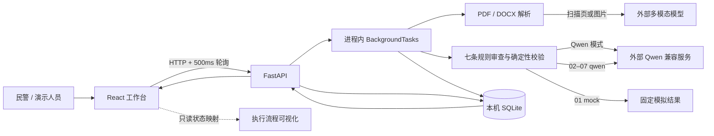
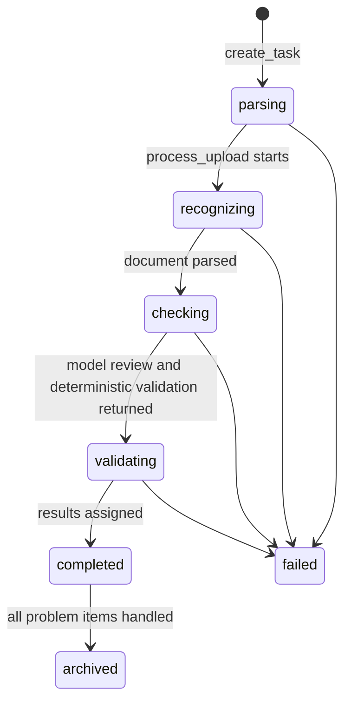

# Bilu 笔录审查助手技术手册

## 1. 快照与阅读路径

### 1.1 仓库快照

| 字段 | 当前状态 |
|---|---|
| 仓库状态 | `main` 分支，基准提交 `1cdd2fcd83495541fb3226d2e1842de1dbcd81ce`；工作区存在大量未提交修改和未跟踪文件。本手册按 2026-07-17 当前工作区代码编写。【已执行验证】 |
| 分析范围 | 全项目核心链路，以及当前差异涉及的 SQLite 持久化、被害人信息、人工分流、归档/历史/报告和执行流程可视化。【代码确认】 |
| 已运行验证 | `backend/.venv/Scripts/python.exe -m pytest -q`：后端 47 项测试通过；`npm --prefix frontend run test`：前端 10 个测试文件、36 项测试通过；前端生产构建通过。【已执行验证】 |
| 其他安全检查 | 读取当前 FastAPI 路由表，确认 15 个应用/API/文档入口可注册；未生成或覆盖 `docs/openapi.json`。【已执行验证】 |
| 未运行 | `npm run verify:model` 会访问当前配置的外部模型服务，本次未运行；没有使用真实或未脱敏材料。【未验证/冲突】 |
| 本次写入 | 只新增 `docs/project-technical-guide.md`，未修改业务代码、测试、配置、API 快照或生成材料。【代码确认】 |

### 1.2 三条阅读路径

- **5 分钟全景**：依次阅读第 2、3、4、7.2、9、11 节。
- **跟完一次真实请求**：从第 5.1 节开始，沿 `frontend/src/App.tsx::handleFile`、`frontend/src/api.ts::pollReviewTask`、`backend/app/main.py::create_upload_review`、`backend/app/services/review.py::process_upload`、`backend/app/services/qwen.py::review_with_qwen` 阅读。
- **准备修改某模块**：先看第 6 节定位所有者，再看第 7、8 节确认契约和规则，最后按第 10.4 节执行回归检查。

## 2. 目标与非目标

### 2.1 用户、问题与产出

- 产品定位为民警问审结束后的**单份询问笔录辅助复盘工具**，不是自动办案系统。【文档声明：`docs/product-requirements-v0.1.md`】
- 日常操作用户是需要核对笔录、定位原文、处理提问遗漏或回答不完整项的办案民警；甲方汇报和演示是当前原型的重要次级场景。【文档声明 + 本轮用户确认】
- 输入是单份脱敏 PDF 或 DOCX，也可选择内置脱敏样例；输出包括标准化原文、七条“三现四流”结果、证据位置、建议补问、人工分流、归档记录和可打印报告数据。【代码确认：`backend/app/main.py`、`frontend/src/App.tsx`】
- 模型结果必须回到已启用规则和笔录原文，并由民警人工复核。【代码确认：`backend/app/services/qwen.py::_validate`；文档声明：`README.md`】

### 2.2 明确非目标

- 不作案件定性、法律结论、责任判断或证据效力判断。【文档声明：`README.md`】
- 真实文件上传和 02–07 演示案例不降级；01 使用明确标识的固定模拟结果，旧 `local` 只为历史数据反序列化保留。【代码确认：`backend/app/demo_cases.py`、`backend/app/services/review.py::process_demo`】
- 当前代码未发现身份认证、角色授权、案件系统集成、任务取消、任务幂等键、队列、审计日志、数据保留策略或批量看板。【代码确认/未验证：仓库入口、配置和依赖清单】
- 当前证据定位是标准化页码和段落号，不等同于 Word 物理页或图片坐标级高亮。【代码确认：`backend/app/services/parser.py`；文档声明：`README.md`】

## 3. 技术与解决方案地图

| 区域 | 技术 | 实际职责 | 证据 | 验证/限制 |
|---|---|---|---|---|
| 前端 | React 18 + TypeScript + Vite | 单页工作台、上传、500ms 轮询、结果/原文联动、人工分流、历史、报告和流程展示 | `frontend/package.json`、`frontend/src/App.tsx` | 生产构建通过；没有端到端浏览器测试【已执行验证/未验证】 |
| 流程画布 | `@xyflow/react` | 可拖拽的说明型流程图和状态着色 | `frontend/src/WorkflowView.tsx` | 它不触发后端任务，只消费 `ReviewTask`【代码确认】 |
| API | FastAPI 0.115.6 + Pydantic | 上传、任务查询、规则/样例、人工决定、归档、历史、补问和报告数据 | `backend/requirements.txt`、`backend/app/main.py` | 路由注册已检查；静态 OpenAPI 快照已过期【已执行验证/未验证/冲突】 |
| 文档解析 | PyMuPDF、python-docx | PDF/DOCX 文字、表格和图片提取，建立页/段索引 | `backend/app/services/parser.py` | 自动化测试覆盖文本 PDF、扫描 PDF、混合 PDF、DOCX 表格/图片和无效文件【已执行验证】 |
| 图像识别 | OpenAI 兼容 `/chat/completions` 多模态请求 | 扫描页和嵌入图片忠实转写 | `backend/app/services/vision.py` | 外部模型本轮未调用；60s 总超时、5s 连接超时【代码确认/未验证】 |
| 规则审查 | Qwen 兼容接口 + strict JSON Schema/Function Calling | 固定七条规则的结构化覆盖判断和证据位置选择 | `backend/app/services/qwen.py` | 模拟响应、重试和校验测试通过；真实服务未验证【已执行验证/未验证】 |
| 快速演示 | 固定模拟结果 + 真实段落检索 | 01 解析真实 DOCX，生成与当前七条规则吻合且明确标识的结果 | `backend/app/services/mock_review.py` | 不可当作 Qwen 或正式审查结论【代码确认/已执行验证】 |
| 持久化 | Python `sqlite3` | 以整份 `ReviewTask` JSON 保存任务、结果和人工决定 | `backend/app/store.py::SqliteTaskStore` | 重建 store 后可读取的测试通过；并发、迁移、加密和保留策略未验证【已执行验证/未验证】 |
| 测试 | Vitest + pytest | 前端纯函数、API、解析、模型契约、持久化和信息提取回归 | `frontend/src/*.test.ts`、`backend/tests` | 65 项测试通过，不代表业务口径或生产合规已获确认【已执行验证】 |

## 4. 架构、数据流与边界



### 4.1 边界说明

- 浏览器和 FastAPI 之间是应用信任边界；上传内容和人工决定进入后端。【代码确认】
- 真实上传文件的解析文本和图片会发送给外部模型服务，必须只使用脱敏材料。【代码确认：`vision.py`、`qwen.py`；文档声明：`README.md`】
- `BackgroundTasks` 在当前 API 进程内执行，不是持久队列；进程中断后的任务恢复、租约和重放机制未发现。【代码确认/未验证】
- SQLite 保存完整任务 JSON；代码中未发现字段级加密、自动过期或清理命令。【代码确认】
- 图中“执行流程可视化”只读取前端 `task.status/reviewStatus`。它不是后端工作流引擎，也不能证明某个视觉节点具有独立执行时长。【代码确认】
- 该图不证明正式部署拓扑、模型服务内部实现、网络隔离、容量或公安业务合规性。【未验证/冲突】

## 5. 端到端工作流

### 5.1 真实文件审查 / 创建任务与轮询

| 字段 | 说明 |
|---|---|
| 目的 | 接收一份 PDF/DOCX，创建异步审查任务，并让前端获得状态和最终结果。 |
| 调用者/下游 | `App::handleFile` → `createUploadTask` → `POST /api/v1/reviews` → `process_upload`；前端并行执行 `pollReviewTask`。 |
| 输入 | 浏览器 `File`；服务端最多读取 `MAX_FILE_SIZE + 1`，硬限制 20 MB。 |
| 处理 | API 创建 `ReviewTask(mode=qwen)` 并交给 `BackgroundTasks`；前端每 500ms 查询一次，最多等待 600 秒。 |
| 输出/状态 | 创建接口返回 `taskId`；查询接口返回整份 `ReviewTask`；终态为 `completed` 或 `failed`。 |
| 校验所有者 | 客户端只限制文件选择类型和模型在线状态；大小、格式、加密、损坏和空内容由服务端最终负责。 |
| 异常/重试 | 网络/API 错误转为 `ApiError`；轮询超时是 `task_timeout`。上传创建没有幂等键，用户重试会创建新任务。 |
| 证据 | `frontend/src/App.tsx::handleFile/completeReview/failReview`、`frontend/src/api.ts::createUploadTask/pollReviewTask`、`backend/app/main.py::create_upload_review`【代码确认】 |
| 调试 | 先看 `GET /api/v1/reviews/{task_id}` 的 `status/errorCode/errorMessage`，再按状态进入 `review.py`、`parser.py` 或模型适配层。 |
| 修改影响 | 同时检查前端 `TaskStatus`、Pydantic `TaskStatus`、轮询终态、流程状态映射和 API 测试。 |

### 5.2 文档标准化 / PDF、DOCX 与图像识别

| 字段 | 说明 |
|---|---|
| 目的 | 把不同文档格式转换为统一的 `ParsedDocument.pages[].paragraphs[]`，为证据定位提供稳定索引。 |
| 调用者/下游 | `process_upload` → `parse_document` → `_parse_pdf/_parse_docx` → 必要时 `transcribe_image`。 |
| 输入 | 不可信文件字节、文件名；PDF 可能是文本、扫描或混合页，DOCX 可能包含正文、表格和图片。 |
| 处理 | PDF 原生文字少于 20 字时整页渲染 OCR；混合 PDF OCR 嵌入图片并去重；DOCX 保留正文/表格顺序，图片结果追加。 |
| 输出/状态 | `ParsedDocument` 包含格式、页数、文本、页/段、来源类型和可选置信度。 |
| 校验所有者 | 解析器校验扩展名、空内容、加密/损坏、最终是否存在文本；视觉适配层校验 JSON、段落数组和 0-1 置信度。 |
| 异常/重试 | 文件问题直接返回 413/415/422。图像识别没有本地回退或显式重试，模型错误使整项任务进入内部 `failed` 状态并清空结果。 |
| 证据 | `backend/app/services/parser.py::parse_document/_parse_pdf/_parse_docx`、`backend/app/services/vision.py::transcribe_image`、`backend/tests/test_api.py` 解析相关测试【代码确认/已执行验证】 |
| 调试 | 使用脱敏最小文件复现；检查 `sourceType`、页码、段落号和视觉响应结构，不输出完整敏感正文到日志。 |
| 修改影响 | 可能破坏证据位置、被害人信息提取、模型提示输入、原文 UI 和 PDF/DOCX 测试。 |

### 5.3 七条规则审查 / 结构化输出、校验与重试

| 字段 | 说明 |
|---|---|
| 目的 | 限制模型只在七条规则和固定事实键内判断，并把模型位置选择转换为可核验原文证据。 |
| 调用者/下游 | `process_upload/process_demo(qwen)` → `review_with_qwen` → strict JSON Schema；必要时同 Schema 纠正重试或 Function Calling。 |
| 输入 | 标准化全文与页/段索引、`rules.json` 的 `requiredFacts/referenceHints`。 |
| 处理 | 模型逐事实返回 `covered/missing/unknown`；后端确定性生成规则状态和 `missingFacts`，校验规则 ID、事实键、状态、证据位置与原文一致性。 |
| 输出/状态 | 固定七条 `ReviewResult`；`referenceHints` 只能进入 `advisories`，不能改变硬状态。 |
| 校验所有者 | Pydantic 负责结构类型，`qwen.py::_validation_payload/_validate` 负责业务和证据一致性。 |
| 异常/重试 | 临时网络/408/429/5xx重试一次；业务/证据校验携带纠正信息完整再生成一次；不支持 JSON Schema 时改用 Function Calling；鉴权不重试。最多两次审查模型调用。 |
| 部分结果 | 第二次仍未通过时整项不返回规则结果；`process_upload/process_demo` 清空 `results`。 |
| 证据 | `backend/app/services/qwen.py::review_with_qwen/_validate`、`backend/tests/test_api.py::test_qwen_*`【代码确认/已执行验证】 |
| 调试 | 使用模拟 HTTP 响应或 `backend/scripts/verify_qwen.py`；后者会访问外部服务，本次未运行。 |
| 修改影响 | 必须同步 `rules.json`、Pydantic 模型、Schema、提示、确定性校验、样例和模型契约测试。 |

### 5.4 人工复核 / 分流、归档、历史与报告

| 字段 | 说明 |
|---|---|
| 目的 | 让民警对 `missing/incomplete` 逐项选择确认、加入补问清单或忽略，完成后归档并回看。 |
| 调用者/下游 | `ResultView` → `PATCH decision` → `update_decision`；全部分流后 `POST complete` → `complete_review`；历史和报告读取 SQLite 中任务。 |
| 输入 | 任务 ID、规则 ID、`confirmed/supplemented/ignored` 和可选 `reason`。 |
| 处理 | 保存单条人工状态；前端自动跳到下一待处理项。只有问题项仍为 `pending` 时禁止归档。 |
| 输出/状态 | `reviewStatus: in_review → archived`，写入 `archivedAt`；补问列表只返回 `supplemented` 项；报告返回完整结果和被害人信息。 |
| 校验所有者 | 后端校验任务已完成、状态允许、规则存在和无待处置项；前端 `reviewState.ts` 提供同口径的按钮启用判断。 |
| 异常/重试 | 404/409/422 通过统一 `AppError` 返回；没有自动重试、并发版本号或冲突检测。重复归档会重新写 `archivedAt`，幂等语义未定义。 |
| 证据 | `backend/app/services/review.py::update_decision/complete_review/review_history/follow_ups/report_data`、`frontend/src/reviewState.ts`、相关测试【代码确认/已执行验证】 |
| 调试 | 先用历史接口确认任务是否存在，再核对 `results[].manualDecision` 和 `pendingCount`。 |
| 修改影响 | 同步后端模型、前端类型、结果页、报告页、历史页和 API/前端状态测试。 |

### 5.5 执行流程页 / 状态可视化而非执行驱动

| 字段 | 说明 |
|---|---|
| 目的 | 向甲方演示系统处理链路，并辅助民警理解当前任务的大致阶段。 |
| 调用者/下游 | 侧栏“执行流程” → `WorkflowView(task)` → `getWorkflowProgress(task.status, task.reviewStatus)`。没有后端调用。 |
| 输入 | 当前 React 内存中的 `ReviewTask`。 |
| 处理 | 把任务状态映射到六个主节点和一个异常节点，更新节点/连线样式；用户可以点击、拖拽和缩放。 |
| 输出/状态 | 仅产生视觉状态，不改变 `ReviewTask`、后端任务或 SQLite。 |
| 实时性边界 | 前端轮询周期是 500ms，但不是每个视觉阶段都有稳定、独立的后端状态。`uploading` 只由前端本地设置；后端任务初始为 `parsing`，随后在真正调用 `parse_document` 前就改为 `recognizing`；`review_with_qwen` 已完成确定性校验后才短暂写入 `validating`。因此当前六节点进度不能按字面视为精确实时执行轨迹。【代码确认】 |
| 页面路径边界 | 审查结束时 `App::completeReview` 自动切到结果页；流程页不是完成业务闭环的必经页面。【代码确认】 |
| 异常呈现 | 当前画布、详情、图例和数据中多次显示“失败/任务终止”，与甲方演示偏好冲突；业务错误仍应在新建审查页以可恢复说明呈现。【代码确认 + 本轮用户反馈】 |
| 测试 | `workflowProgress.test.ts` 只证明状态映射函数；没有证明用户能一眼识别进度，也没有浏览器可用性测试。【已执行验证/未验证】 |
| 修改影响 | 若重新设计，应先确认页面角色和状态口径，再改 `WorkflowView.tsx`、`workflowProgress.ts`、`workflowData.ts` 和样式；不要把视觉节点反向当作后端执行事实。 |

## 6. 模块与代码导航

| 模块/文件 | 负责 | 不负责 | 关键符号 | 消费者 | 接着读/测 |
|---|---|---|---|---|---|
| `frontend/src/App.tsx` | 页面路由状态、任务生命周期、结果交互 | 文档解析、规则判断 | `handleFile`、`completeReview`、`ResultView` | 浏览器入口 | `api.ts`、前端纯函数测试 |
| `frontend/src/api.ts` | HTTP 调用、统一 API 错误、轮询 | 业务规则 | `pollReviewTask`、`submitDecision` | `App.tsx` | FastAPI routes、API 测试 |
| `frontend/src/WorkflowView.tsx` | 流程画布和状态呈现 | 后端执行编排 | `WorkflowView`、`edgesWithProgress` | `App.tsx` | `workflowProgress.ts`、`workflowData.ts` |
| `frontend/src/workflowProgress.ts` | 前端状态到视觉阶段的映射 | 定义后端状态语义 | `getWorkflowProgress` | `WorkflowView` | `workflowProgress.test.ts` |
| `backend/app/main.py` | HTTP 路由、响应模型、BackgroundTasks 入口 | 规则细节、解析实现 | `/api/v1/*` | 前端 | `services/review.py`、`models.py` |
| `backend/app/services/review.py` | 任务编排、状态推进、人工闭环 | 模型协议细节 | `process_upload`、`complete_review` | routes/background task | API 测试 |
| `backend/app/services/parser.py` | PDF/DOCX 标准化和页段索引 | 规则判断 | `parse_document` | `review.py` | 解析测试、`vision.py` |
| `backend/app/services/vision.py` | 图片转写协议与响应校验 | 文档分页、规则审查 | `transcribe_image` | parser | 扫描/图片测试 |
| `backend/app/services/qwen.py` | Schema、模型请求、重试和确定性校验 | 人工分流 | `review_with_qwen`、`_validate` | review service | Qwen 契约测试 |
| `backend/app/demo_cases.py` | 七案例白名单、文件路径和固定执行模式 | 任意路径加载 | `DEMO_CASES`、`load_demo_document` | routes/review service | `test_demo_cases.py` |
| `backend/app/services/mock_review.py` | 01 的明确标识模拟结果和动态证据位置 | Qwen 判断 | `build_mock_review` | `process_demo(mock)` | demo API 测试 |
| `backend/app/store.py` | SQLite 任务 JSON 持久化 | 业务状态合法性、迁移 | `SqliteTaskStore` | review service | `test_store.py` |
| `backend/rules.json` | 七条规则、事实键、提示与来源 | 批准规则真实性 | `requiredFacts`、`referenceHints` | analyzer/qwen/routes | 规则与模型测试、人工确认 |

推荐阅读顺序：`main.py` → `review.py` → `models.py` → `parser.py`/`qwen.py` → `store.py` → `App.tsx`/`api.ts` → 对应测试。

## 7. 接口、数据与状态契约

### 7.1 公共路由

| 方法 | 路径 | 请求/用途 | 主要响应 | 主要错误 | 证据 |
|---|---|---|---|---|---|
| GET | `/api/v1/health` | 无；检查模型和规则数 | `HealthResponse` | 模型不可达时仍返回健康结构 | `main.py::health`【代码确认】 |
| GET | `/api/v1/rules` | 无；规则摘要 | `RuleListResponse` | 未定义业务错误 | `main.py::list_rules`【代码确认】 |
| GET | `/api/v1/demos` | 无；脱敏样例 | `DemoListResponse` | 未定义业务错误 | `main.py::list_demos`【代码确认】 |
| POST | `/api/v1/reviews` | multipart `file` | 202 + `taskId/status` | 413、后续任务内部错误 | `main.py::create_upload_review`【代码确认】 |
| POST | `/api/v1/reviews/demos/{demo_id}` | 无请求体；模式由服务端目录决定 | 202 + `taskId/status` | 404、503 | `main.py::create_demo_review`【代码确认】 |
| GET | `/api/v1/reviews` | 无；历史列表 | `ReviewListResponse` | 未定义业务错误 | `main.py::list_reviews`【代码确认】 |
| GET | `/api/v1/reviews/{task_id}` | 任务 ID | 完整 `ReviewTask` | 404 | `main.py::review_detail`【代码确认】 |
| PATCH | `/api/v1/reviews/{task_id}/results/{rule_id}/decision` | `DecisionRequest` | 更新后的规则结果 | 404/409/422 | `main.py::save_decision`【代码确认】 |
| POST | `/api/v1/reviews/{task_id}/complete` | 无 | `reviewStatus/archivedAt` | 404/409 | `main.py::archive_review`【代码确认】 |
| GET | `/api/v1/reviews/{task_id}/follow-ups` | 任务 ID | 已加入清单的结果 | 404 | `main.py::review_follow_ups`【代码确认】 |
| GET | `/api/v1/reviews/{task_id}/report-data` | 任务 ID | `ReportData` | 404 | `main.py::review_report_data`【代码确认】 |

统一应用错误响应为 `{ "error": { "code": "...", "message": "..." } }`。FastAPI/Pydantic 自带 422 的响应形状不经过 `AppError` 包装，前端会退化为通用错误文案。【代码确认】

### 7.2 状态机



- 后端 `TaskStatus` 没有 `idle`，前端为未创建任务增加了 `idle`。【代码确认】
- 后端枚举含 `uploading`，但当前后端流程没有写入该状态；它只由前端上传前临时设置。【代码确认】
- `reviewStatus` 与处理状态正交：处理完成后仍是 `in_review`，人工闭环后才是 `archived`。【代码确认】
- `ManualStatus.pending` 对 `covered/not_applicable` 不阻止归档；只有 `missing/incomplete + pending` 会阻止。【代码确认/已执行验证】
- 没有取消、暂停、恢复、版本号或乐观锁状态。【代码确认】

### 7.3 需要同步修改的重复契约

| 契约 | 后端来源 | 前端副本 | 风险 |
|---|---|---|---|
| 任务状态 | `models.py::TaskStatus` | `types.ts::TaskStatus`、`App.tsx::taskStatusLabel`、`workflowProgress.ts` | 新增/改名后若不同步，轮询和流程页会错误 |
| 规则状态 | `models.py::RuleStatus` | `types.ts::RuleStatus`、`App.tsx::statusMeta` | 汇总、筛选和报告口径错误 |
| 人工状态 | `models.py::ManualStatus` | `types.ts::ManualStatus`、`App.tsx::manualLabel` | 完成条件和文案不一致 |
| 任务/报告数据 | Pydantic models | TypeScript interfaces | 运行期 `fetch` 不做结构校验，漂移可能静默进入 UI |
| API 快照 | FastAPI 动态 OpenAPI | `docs/openapi.json` | 当前快照缺少新增历史、归档、补问和报告接口【未验证/冲突】 |

### 7.4 规则修改分级与联动范围

当前规则管理页只读。`backend/app/data.py` 在进程启动时从 `backend/rules.json` 加载 `RULES`，`GET /api/v1/rules` 只返回摘要，仓库中没有规则新增、修改、校验、发布、回滚或版本接口。【代码确认】

| 修改内容 | 当前消费者 | 是否通常需要改代码 | 必须联动的验证/资产 |
|---|---|---|---|
| `name` | 模型提示、结果/规则页显示 | 否 | 页面文案检查、脱敏样例回归 |
| `category`、`source` | 结果和规则页显示 | 否 | 页面/API 展示检查 |
| `sourceNote` | 当前无运行时消费者 | 否 | 若要展示或审计，需要先增加明确消费者 |
| `evidencePolicy`、`suggestedQuestion` | 模型提示、补问建议 | 否 | 模型回归、建议补问人工抽查 |
| `referenceHints[].label` | 模型提示与非强制 `advisories` | 否 | 确认不能进入 `missingFacts`，运行补充提示边界测试 |
| `referenceHints[].keywords` | 当前运行时无消费者 | 否 | Qwen 正式审查不直接读取这些关键词 |
| `requiredFacts[].label` | JSON Schema 动态键、模型提示、状态推导、`missingFacts` 白名单、01 模拟结果 | 代码通常无需手改，但属于判定逻辑变更 | 更新 01 预期、Schema/模型契约测试和业务批准版本 |
| `requiredFacts[].keywords` | 01 模拟结果的证据段落评分 | 否 | 01 证据定位回归；不会直接改变 Qwen 提示中的事实标签 |
| `scope`、`triggers` | 条件适用性和 `not_applicable` 确定性校验 | 现有 `base/conditional` 范围内通常不需要 | 条件触发/不触发样例、状态一致性测试、业务批准 |
| `id` | JSON Schema 顶层键、模型输出键、历史结果关联、前端排序 | 不建议修改已发布 ID；重命名需兼容/迁移设计 | 历史数据兼容、API/前端/模型测试和规则版本迁移 |
| `group` | 后端按“三现/四流”并行分组，前端固定按两组展示 | 在现有两组间移动通常不需要；新增组必须改代码 | `review_with_qwen` 分组列表、`groupRules`、类型、页面和测试 |
| 规则数量 | Schema 可动态生成，健康接口动态计数 | 添加/删除规则仍需改硬编码“七条”等文案和测试 | 完整性测试、提示/工具说明、页面、文档、回归集 |
| `_prompt` 中全局角色与判定说明 | 所有 Qwen 审查 | 改提示文本本身不要求改确定性校验 | 必须跑模型回归；若改变状态含义/证据要求，则必须同步 `_validate`、Schema 和测试 |

因此“提示词修改”要分两类：只优化表达时，后端确定性逻辑可以不改；如果提示词改变了 `covered/missing/unknown` 的定义、证据要求、强制事实或适用条件，就已经是规则逻辑变更，必须同步 Schema、`_validate`、样例、测试和规则版本。【代码确认：`qwen.py::_prompt/_rule_result_schema/_validation_payload/_validate`】

### 7.5 `rules.json` 字段实际生效情况

正式 Qwen 提示不是完全由 `rules.json` 提供。它由三部分拼接：`qwen.py::_prompt` 中固定的角色、状态定义和证据约束；`rules.json` 中选定规则的业务字段；当前标准化笔录全文。JSON Schema 和最终状态推导则由 `qwen.py::_rule_result_schema/_validation_payload/_validate` 负责。【代码确认】

当前文件共有 7 条规则、30 个 `requiredFacts` 和 13 个 `referenceHints`；7 条规则全部为 `scope=base`，全部 `triggers` 为空。【已执行验证：PowerShell JSON 结构统计】

| 字段 | 正式 Qwen 审查 | 01 快速模拟 | 页面/API | 当前结论 |
|---|---|---|---|---|
| `id` | Schema 顶层键、输出完整性校验 | 结果 ID | 显示/关联 | 强生效，不应随意改名 |
| `name` | 进入提示，构造缺失证据说明 | 结果名称 | 显示 | 生效 |
| `group` | 进入提示，并决定“三现/四流”并行分组 | 结果分组 | 前端分组 | 强生效 |
| `category` | 不进入当前提示 | 写入结果 | API/结果页显示 | 展示元数据，不影响正式模型判定 |
| `scope` | 进入提示，并由 `_validate` 校验适用状态 | 决定是否适用 | 规则页显示 | 生效；当前全为 `base` |
| `triggers` | 进入提示，条件规则时由后端确定性检查 | 条件规则适用判断 | 不展示 | 代码支持，但当前全为空且规则全为 `base`，实际无触发效果 |
| `requiredFacts[].label` | 进入提示、动态 Schema、状态推导、缺失白名单 | 覆盖判断标签 | 规则页显示 | 核心判定字段，强生效 |
| `requiredFacts[].keywords` | 不进入正式 Qwen 提示或 Schema | 证据段落评分 | 不展示 | 只影响 01 的证据选段 |
| `referenceHints[].label` | 进入提示，只允许生成非强制 `advisories` | 生成补充关注 | 不展示规则详情 | 生效，但不能改变强制状态 |
| `referenceHints[].keywords` | 不进入正式 Qwen 提示 | 不使用 | 不展示 | 当前运行时无引用 |
| `evidencePolicy` | 进入正式提示 | 不直接使用 | 不展示 | 影响模型选证据的指导语，但后端仍以位置校验为准 |
| `suggestedQuestion` | 进入正式提示作为规则参考 | 直接作为默认补问 | 结果页展示 | 生效；正式 Qwen 仍可返回自己的建议问法 |
| `source` | 不进入正式提示 | 不影响判断 | 规则摘要 API/页面显示 | 仅来源标签 |
| `sourceNote` | 不使用 | 不使用 | 不展示 | 当前运行时无引用 |

“代码中生效”不等于“公安业务上已经正式有效”。当前 `source` 是 `working_rule`，`sourceNote` 声明为项目工作口径；自动化测试只证明结构、边界和程序行为，不能证明 30 个必查事实已经获得业务方正式批准。【代码确认/未验证/冲突】

## 8. 校验规则矩阵

### 8.1 七条业务工作规则

| 规则 | 来源 | 强制事实摘要 | 结果 | 测试证据 | 人工确认 |
|---|---|---|---|---|---|
| `PRESENT-001` 案发现场 | `rules.json` `working_rule` | 时间、地点、设备/环境、在场人员、关键操作 | 四态之一 | API 样例与模型契约测试【已执行验证】 | 甲方确认事实集合和术语 |
| `PRESENT-002` 涉案现物 | 同上 | 设备/载体、保存情况、提取/查验 | 四态之一 | 同上 | 确认现物范围和处置口径 |
| `PRESENT-003` 电子现痕 | 同上 | 痕迹种类、账号标识、保存/灭失 | 四态之一 | 同上 | 确认电子痕迹最小要素 |
| `FLOW-001` 人员流 | 同上 | 被害人、对方、关联人员、人员关系 | 四态之一 | 同上 | 确认人员关系是否均为硬要求 |
| `FLOW-002` 信息流 | 同上 | 接触渠道、平台账号、话术指令、传递过程 | 四态之一 | 同上 | 确认平台账号等字段口径 |
| `FLOW-003` 资金流 | 同上 | 逐笔时间金额、付款/收款、渠道、流水、总损失、处置 | 四态之一 | 同上 | 确认不同支付场景适配性 |
| `FLOW-004` 行为流 | 同上 | 引流、下载/指令、付款、发现被骗、报案处置 | 四态之一 | 同上 | 确认时间线要素和阶段名称 |

当前七条 `scope` 均为 `base`，代码支持 `conditional`，但当前配置没有条件规则；因此 `not_applicable` 在当前真实规则配置中理论上不会由后端 Qwen 校验接受。【代码确认】

### 8.2 技术与业务校验

| 规则 | 来源 | 所有者/层 | 触发 | 通过条件 | 不通过结果 | 错误表面 | 测试证据 | 人工检查 |
|---|---|---|---|---|---|---|---|---|
| 文件大小 | `MAX_FILE_SIZE` | API + parser | 上传 | `<=20MB` | 拒绝 | 413 `file_too_large` | API 测试部分覆盖【已执行验证】 | 确认 20MB 是产品硬限制 |
| 文件类型 | parser | 服务端 | 解析 | PDF/DOCX | 拒绝；DOC 单独指导转换 | 415 | `test_legacy_doc...`【已执行验证】 | 确认是否允许其他格式 |
| 文档可读性 | parser | 服务端 | 打开/提取 | 未加密、未损坏且有内容 | 整项不生成结果 | 422 `parse_failed/empty_document` | 解析错误测试【已执行验证】 | 用甲方约定样例验收 |
| 视觉响应 | vision | 模型适配层 | OCR | JSON、段落列表、0-1置信度 | 整项任务内部失败 | `invalid_vision_response` | 扫描/混合文档 mock 测试【已执行验证】 | 真实模型 OCR 质量未验证 |
| 固定七条 Schema | qwen | 模型适配 + Pydantic | 审查响应 | 七个固定 ID、无额外字段 | 完整重试或整项不返回 | 502 系列 | strict schema 测试【已执行验证】 | 确认供应商支持能力 |
| `factCoverage` 键 | rules + qwen | 确定性校验 | 每条规则 | 与 `requiredFacts` 完全相同 | 完整纠正重试 | `invalid_model_results` | 校验反馈测试【已执行验证】 | 规则变更需重新批准 |
| 强制字段与提示分离 | rules + qwen | 确定性校验 | `missingFacts/advisories` | 缺失项只来自强制事实 | 拒绝模型结果 | `invalid_model_results` | supplementary tests【已执行验证】 | 确认哪些是硬要求 |
| 证据位置 | qwen | 确定性校验 | covered/incomplete | 页/段存在且证据文本相符 | 完整纠正重试 | `insufficient_evidence` | API/model tests【已执行验证】 | 人工抽查定位准确性 |
| 人工分流 | review service | 后端 + 前端提示 | PATCH | completed 任务、允许状态、规则存在 | 拒绝保存 | 404/409/422 | API + reviewState tests【已执行验证】 | 确认“忽略无需原因”口径 |
| 完成复核 | review service | 后端最终负责 | POST complete | 所有问题项已分流 | 不归档 | 409 `review_has_pending_results` | API test【已执行验证】 | 确认归档是否允许再次修改 |
| 脱敏边界 | README/页面提示 | 人工与部署流程 | 上传前 | 只使用脱敏材料 | 代码未自动识别敏感信息 | 无自动错误 | 无【未验证】 | 必须由甲方确认操作与制度 |

## 9. 错误与运行特性

| 主题 | 状态 | 当前行为与证据 |
|---|---|---|
| 无效输入 | 已实现 | 大小、格式、加密、损坏、空文档由 API/parser 拒绝【代码确认/已执行验证】 |
| 外部依赖不可用 | 部分实现 | 健康检查和模型错误码存在；真实外部服务本轮未验证【代码确认/未验证】 |
| 超时 | 已实现/部分 | OCR 60s、审查 120s、连接 5s、前端轮询 600s；没有总任务服务端截止时间【代码确认】 |
| 重试/回退 | 部分实现 | 审查模型最多两次，并可 Schema→Function Calling；OCR 无重试；真实上传不回退本地分析【代码确认/已执行验证】 |
| 取消 | 未发现 | 前端没有 AbortController，后端没有取消接口【代码确认】 |
| 幂等 | 未发现 | 上传无幂等键；重复完成会重写归档时间【代码确认】 |
| 并发 | 未验证 | SQLite 每次新连接、整任务 JSON 覆盖；无版本号或冲突检测【代码确认/未验证】 |
| 持久化/恢复 | 部分实现 | SQLite 可跨 store 实例读取；后台执行中的进程中断恢复未实现【已执行验证/代码确认】 |
| 保留/删除 | 未发现 | 无到期、清理、删除或导出后销毁策略【代码确认】 |
| 认证/授权 | 未发现 | API 未配置用户身份或角色依赖，CORS 只限制来源【代码确认】 |
| 隐私 | 部分实现 | UI/README 要求脱敏，但代码会保存完整任务 JSON并把内容发往模型；无自动脱敏/加密证据【代码确认】 |
| 可观测性 | 较弱 | 有稳定错误码和任务错误字段；未发现结构化日志、指标或追踪【代码确认】 |
| 性能 | 未验证 | 文档声明目标 60 秒，但前端允许等待 600 秒；没有基准结果【文档声明/未验证/冲突】 |

错误对用户的推荐呈现应分为“文件需要调整”“服务暂不可用”“结果未通过校验”三类，并给出恢复动作。技术错误码保留在任务/API中，不应在甲方主流程图中放大展示。【合理推断，依据 `errorPresentation.ts` 与本轮用户反馈】

## 10. 使用、调试与安全修改

### 10.1 环境准备

```powershell
npm install
npm --prefix frontend install
python -m venv backend\.venv
backend\.venv\Scripts\python.exe -m pip install -r backend\requirements.txt
```

复制 `backend/.env.example` 为 `backend/.env.local`，只填写变量 `QWEN_BASE_URL`、`QWEN_API_KEY`、`QWEN_MODEL`、`FRONTEND_ORIGIN`；可选 `REVIEW_DATABASE_PATH`。不要在文档、测试输出或提交中写真实值。

### 10.2 启动与检查

```powershell
npm run dev
npm test
npm run build
npm run verify:model
```

- `npm run dev`：前端 `http://127.0.0.1:4173`，后端 `http://127.0.0.1:8787`。
- `npm test` 和 `npm run build` 本次已执行通过。【已执行验证】
- `npm run verify:model` 会访问配置的外部模型，只应用脱敏样例，在已授权网络环境中运行；本次未执行。【未验证】
- Swagger：`http://127.0.0.1:8787/api/docs`。

### 10.3 调试入口

1. 上传前先查 `GET /api/v1/health`，确认 `qwen.configured/reachable`。
2. 拿到 `taskId` 后查任务详情，依据 `status/errorCode` 定位到 parser、vision、qwen 或 review service。
3. 规则问题先检查 `backend/rules.json`，再看模型原始结构是否满足 Schema；不要绕过 `_validate`。
4. 证据错位先核对 `ParsedDocument.pages[].paragraphs[]`，区分 PDF 真实页与 DOCX 逻辑页。
5. 历史/归档问题检查 SQLite 中任务 JSON和 `reviewStatus/manualDecision`，不要直接改数据库绕过服务校验。
6. 流程页视觉错误先对照 `workflowProgress.ts` 与真实 `review.py` 状态写入点，不能只看节点文案。

### 10.4 修改与回归清单

| 修改区域 | 必跑检查 |
|---|---|
| 状态枚举/执行流程 | `workflowProgress.test.ts`、前端构建、真实轮询时序人工检查 |
| PDF/DOCX/OCR | 后端解析相关测试、脱敏样例人工定位检查 |
| 七条规则/Schema | 全部 Qwen 契约测试、规则摘要接口、经批准的脱敏回归集 |
| 人工分流/归档 | `reviewState.test.ts`、API 完成闭环测试、历史和报告回看 |
| SQLite 模型 | `test_store.py`、服务重启回看、迁移/兼容性检查 |
| 前后端字段 | `npm test`、`npm run build`、动态 OpenAPI 与前端类型人工比对 |

## 11. 当前变更影响与人工确认

| 变更区域 | 直接行为变化 | 传递影响 | 证据 | 回归检查 | 人工决定 |
|---|---|---|---|---|---|
| SQLite 存储 | 从进程内字典改为本机数据库保存任务 JSON | 历史、重启回看、隐私和保留责任改变 | `store.py` 当前 diff【代码确认】 | store/API 测试通过 | 确认正式环境存储位置、加密、保留和删除策略 |
| 人工闭环 | 新增归档、历史、补问和报告接口/页面 | `ReviewTask`/前端类型扩大 | `main.py`、`review.py`、`App.tsx` diff【代码确认】 | 前后端测试通过 | 确认归档后是否只读、是否允许撤销 |
| 忽略处理 | 不再强制填写原因 | 操作更快，但审计信息减少 | `review.py`、PRD diff【代码确认】 | API/前端状态测试通过 | 甲方确认该业务口径 |
| 被害人信息 | 从原文显式提取并在结果/报告展示 | 增加个人信息展示和持久化范围 | `victim_profile.py`、models/App diff【代码确认】 | 5 个提取测试通过 | 确认展示权限、遮罩和报告字段 |
| 执行流程状态 | 静态流程图增加任务状态映射 | 造成“像实时但阶段语义并不精确”的认知风险 | `WorkflowView.tsx`、`workflowProgress.ts`【代码确认】 | 4 个映射测试通过 | 已确认以甲方演示为主、兼顾民警；需继续确认完成后的跳转和呈现 |
| 生成测试材料 | 新增/更新多份 DOCX/PDF 和生成脚本 | 回归语料与仓库体积变化 | 当前工作区 diff/status【代码确认】 | 生成脚本测试通过 | 确认生成二进制是否应纳入版本控制 |
| 七案例演示 | 旧三条短文本移除；01 mock，02–07 Qwen | API/前端类型、离线可用性和报告来源同步变化 | `demo_cases.py`、`mock_review.py`、`App.tsx`【代码确认】 | 后端 47 项、前端 36 项及构建通过 | 确认七份材料及预期结论可用于甲方演示 |

本次分析没有把工作区中的既有改动归因于某个作者，也没有修改这些文件。

## 12. 未知、冲突与证据索引

### 12.1 未知与冲突

1. `README.md` 声明任务只在内存保存、重启后清空；当前 `store.py` 已使用 SQLite。以当前运行代码为现状，但产品和隐私口径需要人工修正文档。【未验证/冲突】
2. 静态 `docs/openapi.json` 已按当前 FastAPI 应用刷新；前端 TypeScript 类型仍需在接口变化时人工同步。【已执行验证/代码确认】
3. PRD 仍有“审查记录、报告导出仅做入口或视觉预留”的旧表述，而当前代码已实现历史、报告数据和浏览器打印页面。【未验证/冲突】
4. “常规文档不超过 60 秒”是文档目标，没有本轮性能实测；前端轮询上限是 600 秒。【未验证/冲突】
5. 当前流程图把前端状态映射为六个业务节点，但后端状态写入时机不能精确证明这些节点正在独立执行。【代码确认/冲突】
6. 外部 Qwen 真实服务、供应商 strict JSON Schema 支持、图像识别质量和内网部署均未在本轮验证。【未验证】
7. 七条规则标为项目工作口径；代码和测试不能证明其已获公安业务方正式批准。【未验证】
8. 未发现认证、授权、审计、自动脱敏、数据清理、并发冲突和中断恢复机制；正式部署前需要单独评审。【代码确认/未验证】

### 12.2 关键证据索引

- `README.md`：产品定位、输入边界、模型与证据说明、运行命令。
- `docs/product-requirements-v0.1.md`：目标用户、V1范围、状态与验收意图。
- `backend/app/main.py::create_upload_review/review_detail/archive_review`：HTTP 入口。
- `backend/app/services/review.py::process_upload/process_demo/update_decision/complete_review`：任务编排和人工闭环。
- `backend/app/services/parser.py::parse_document`：文档标准化和错误边界。
- `backend/app/services/vision.py::transcribe_image`：图片外部调用契约。
- `backend/app/services/qwen.py::review_with_qwen/_validate`：结构化审查、重试和确定性校验。
- `backend/app/store.py::SqliteTaskStore`：持久化形态。
- `backend/rules.json`：七条规则及强制事实/补充提示来源。
- `frontend/src/App.tsx::handleFile/completeReview/ResultView`：用户主路径。
- `frontend/src/api.ts::pollReviewTask`：500ms 轮询与600秒上限。
- `frontend/src/WorkflowView.tsx::WorkflowView`、`frontend/src/workflowProgress.ts::getWorkflowProgress`：流程可视化边界。
- `backend/tests/test_api.py`、`backend/tests/test_store.py`、`backend/tests/test_victim_profile.py`、`frontend/src/*.test.ts`：本轮已执行回归证据。

### 12.3 当前需要人工确认的事项

- 甲方是否批准当前七条规则及每条 `requiredFacts` 为正式审查口径。
- SQLite 中脱敏笔录、被害人信息和人工决定的保存期限、删除方式和访问权限。
- 归档后是否允许重新编辑或撤销，重复完成是否应保持原 `archivedAt`。
- 执行流程页完成后是停留并突出“查看审查结果”，还是自动切换结果页。
- 面向甲方的流程页应隐藏技术错误分支；具体问题应在上传区以中性、可恢复文案单独呈现。
